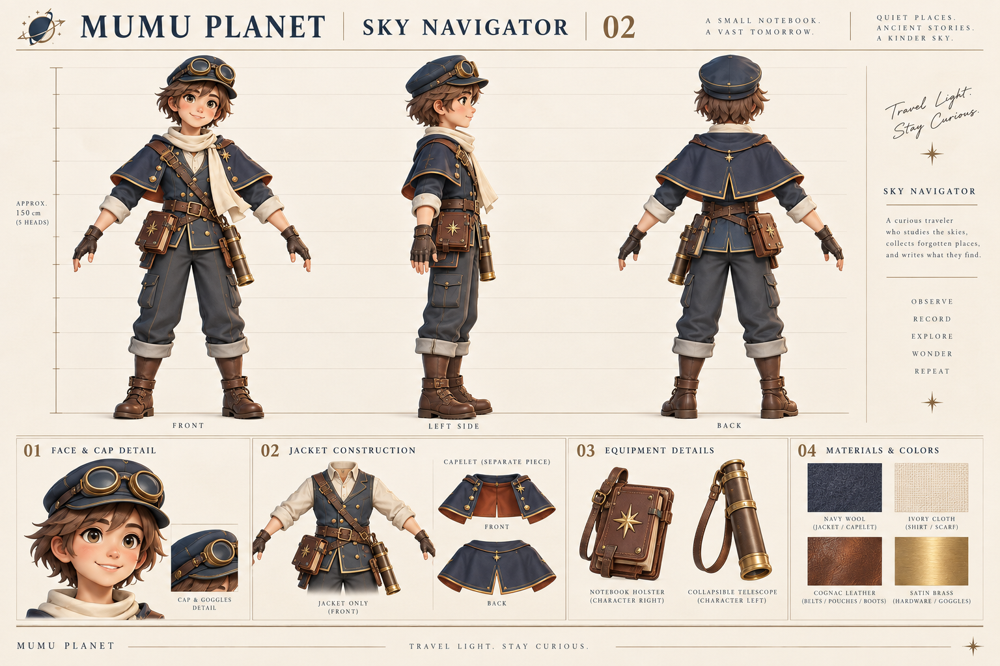
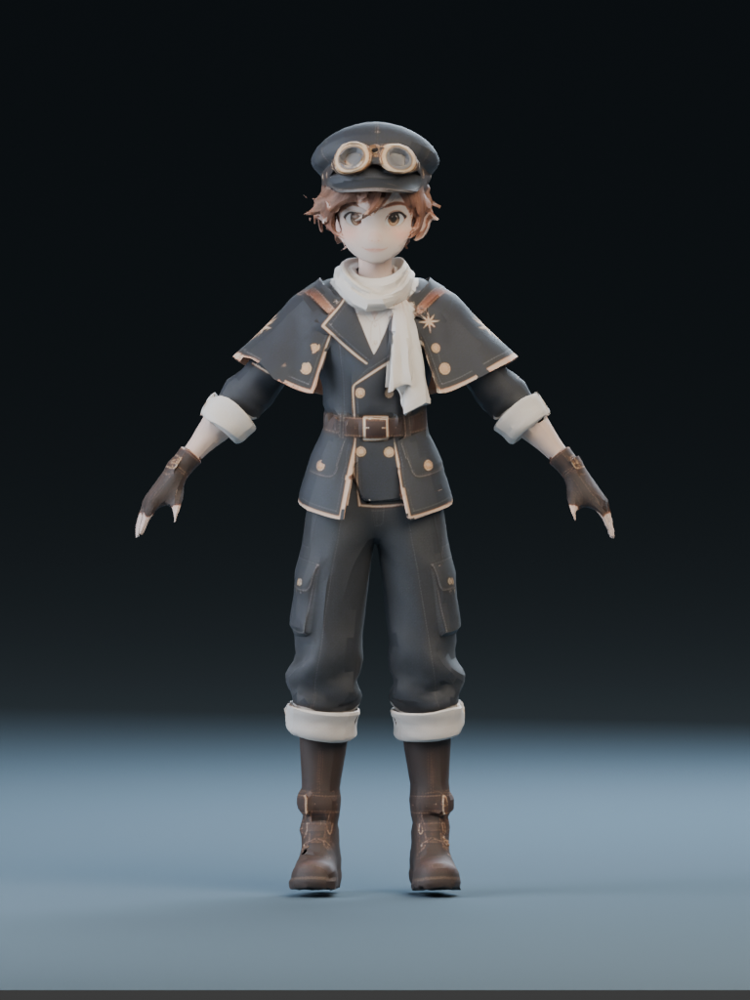
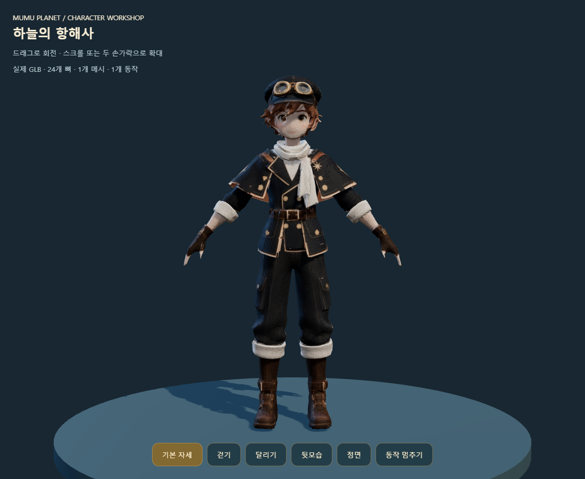

# 하늘의 항해사 — 캐릭터 디자인 확정

2026-09-10. 사용자 선택: 세 후보 중 **02 SKY NAVIGATOR**.

[원래 후보 비교](character-candidates-v01.png)

## 확정 외형

- 짧은 챙의 남청색 항해 모자와 모자 위 황동 고글. 갈색 머리와 친근한 표정.
- 남청색 항해 재킷, 아이보리 셔츠·목도리, 짧은 어깨 망토, 황동 테두리와 적갈색 안감.
- 짙은 회색 바지, 접힌 바짓단, 갈색 가죽 부츠와 손가락이 드러나는 장갑.
- 캐릭터 본인 기준 **오른쪽 허리에 수첩**, **왼쪽 허리에 접이식 망원경**. 정면 이미지의 화면상 좌우와 혼동하지 않는다.
- 큰 챙 모자나 긴 별자리 망토로 바꾸지 않는다. 범선 여행자의 인상을 유지한다.

## 시안 해석과 보정

AI 생성 이미지이며 실제 Blender 모델·정확한 정투상 설계도는 아니다. 이미지에 적힌 신장 수치는 게임 크기 기준으로 채택하지 않는다. 게임의 기존 캐릭터 높이와 발바닥 기준에 맞춘다.

상단 정면과 후면을 의상 기준으로 사용한다. 측면에서는 양쪽 소품의 가림·위치가 정확하지 않으므로 위에 명시한 좌우 배치를 우선한다. 아래 재킷 상세의 흰 소매는 상단 남청색 소매와 다르다. 실제 모델에서는 **남청색 재킷 소매 + 아이보리 접힌 커프스**로 통일한다.

목도리 끝은 허리띠 위에서 끝내고 망토는 팔꿈치 위로 짧게 한다. 상자 들기에서 팔과 상자를 가리지 않도록 어깨 주변을 열고, 망토 뒤 중앙에 트임을 둔다. 작은 단추와 박음질은 작은 화면에서도 읽히는 요소부터 남긴다.

## Blender 제작 순서

1. 머리·몸통·손발과 의상 기본 덩어리를 만들고 게임 카메라 거리에서 앞·뒤 실루엣을 확인한다.
2. 얼굴, 모자·고글, 재킷·망토, 수첩·망원경을 별도 부품으로 제작한다. 화면에 안 보이는 장식보다 얼굴과 뒷모습을 우선한다.
3. 몸통·골반·팔·다리 뼈대를 만들고 팔꿈치·무릎의 굽힘, 상자를 든 자세에서 의상 겹침을 확인한다. 망토·목도리는 짧은 보조 뼈로 제어한다.
4. 대기 → 걷기 → 달리기 → 점프·착지 → 상자 들기 순서로 동작을 제작한다. 수첩 펼치기는 소품을 손에 부착하는 별도 동작으로 연결한다.
5. GLB로 내보내기 후 기존 이동·상호작용·저장 동작을 유지하면서 캐릭터 표시와 애니메이션 연결을 교체한다. 실제 브라우저에서 부하와 손·발 정렬을 확인한다.

## 제작 준비 실행 결과

사용자가 지목한 ‘퍼스트퀸 게임 정보 확인’ 프로젝트에서 `docs/MESHY_BLENDER_3D_PIPELINE.md`와 `docs/MESHY_TAEO_RIGGED_PIPELINE.md`를 확인했다. 그곳에는 Meshy 원본 → Blender 정리 → 골격·애니메이션 → 엔진 검증 작업 기록이 있다. Godot 전용 임포터 보정은 현재 Three.js 프로젝트에 그대로 적용하지 않는다.

- [정면 입력](reference/front-v01.png), [후면 입력](reference/back-v01.png), [측면 입력](reference/right-v01.png)을 개별 이미지로 생성했다. 수첩·망원경은 별도 부품으로 만들기 위해 몸 입력에서 제외했다.
- 측면 이미지의 큰 어깨 별은 정면·후면과 다르므로 확정 장식이 아니다. 생성 시 정면을 주 기준으로 하고 Blender에서 검수한다. 세 이미지의 포즈·비율이 완벽히 동일하다고 간주하지 않는다.
- Blender 4.5.3 LTS로 [제작 준비 파일](sky-navigator-preparation-v01.blend)을 실제 저장했다. 이미지 3개를 내장하고 **20본의 미결합 골격 가이드**를 배치했다. 완성 메시나 스킨 가중치가 있는 캐릭터 파일은 아니다.
- 재생성: `blender --background --factory-startup --python tools/blender/prepare_sky_navigator.py`. 생성 메시지와 [준비 상태](preparation-report.json)를 확인했다.
- 현재 프로세스와 사용자 환경에서 Meshy API 키의 존재 여부만 확인했으며 둘 다 없었다. 비밀 값은 읽어 출력하거나 파일에 저장하지 않았다. Meshy 생성·자동 리깅 요청은 아직 보내지 않았다.

위 내용은 연결 전 준비 기록이다. 이후 사용자가 키를 제공하고 계속 사용하도록 지시하여 Windows 사용자 환경 변수에 등록했다. 키는 코드·문서·모델 기록에 포함하지 않는다.

## 실제 3D 제작 진행

`tools/meshy-navigator.ps1`에서 기존 작업 ID를 보존하며 생성·상태 확인·다운로드를 분리한다. 원본 응답의 서명 URL은 Git에서 제외되는 `.integration` 아래에만 보관한다. 같은 단계의 기록이 있으면 재접수하지 않아 중복 생성을 방지한다.

모델 생성: Meshy 7, 정면·후면·측면, A 포즈, 쿼드 목표 16,000, PBR 2K, 조명 제거. 목표 폴리곤 수는 실측 결과와 다를 수 있다. [공식 다중 이미지 API](https://docs.meshy.ai/en/api/multi-image-to-3d)와 [리깅 API](https://docs.meshy.ai/en/api/rigging)를 확인했다.

- 원본 모델: [navigator-model-v01.glb](source/navigator-model-v01.glb)
- [생성 이력](source/model-provenance.json)
- Blender 검수 스크립트: `tools/blender/review_sky_navigator.py`
- 브라우저 검수: `tools/check-navigator.cjs`

### 리깅·실제 검수 완료

- [Blender 편집본](sky-navigator-rigged-v01.blend): 실제 캐릭터 메시와 24본 골격, 연결된 가중치, 내장 텍스처, 조명·카메라. 준비용 가이드 파일과 다르다.
- [기본 리깅 GLB](source/navigator-rigged-v01.glb), [걷기](source/navigator-walking-v01.glb), [달리기](source/navigator-running-v01.glb). 각 파일의 동작은 별도이며, Blender 편집본에 세 클립을 합쳤다는 뜻은 아니다.
- [검수 화면](preview.html): 회전·확대, 정면·후면, 기본 자세·걷기·달리기·일시정지.
- 메시 1개, 정점 31,142, 삼각형 36,218, 골격 24본, 가중치 누락 정점 0. 모델 높이는 1.5로 맞췄다. [Blender 검사](model-review.json)
- 파일 헤더·스킨 속성·골격 개수·걷기/달리기의 실제 본 변화·브라우저 오류 검사를 통과했다. [실행 결과](browser-review.json)

Blender의 뼈 표시용 Icosphere는 캐릭터가 아니므로 높이와 정점 검사에서 제외했다. 내장 PNG를 명시적으로 다시 연결해 분홍색 누락 텍스처 문제를 수정했다. 생성된 재질의 발광을 끄고 거칠기를 조절하여 편집본과 검수 화면에 적용했다. Meshy 원본 GLB는 보존했다.

현재 결과는 실제 움직이는 **몸체 1차 모델**이다. 시안의 얼굴·손가락·금속 장식은 일부 단순화됐으며, 자동 리깅에는 개별 손가락·망토 전용 뼈가 없다. 별도 수첩·망원경 소품, 점프·상자 들기·수첩 펼치기와 게임 애니메이션 연결은 남아 있다. 자동 리깅 검사 통과가 모든 자세에서 의상 겹침이 없음을 보장하지는 않는다.

이후 [로컬 게임 연결](../../reports/2026-09-10/NAVIGATOR_GAME.md)을 완료했다. Blender 수첩·망원경, 기존 이동에 연결한 골격 동작과 게임용 자세가 적용돼 있다. 공개 배포는 아직 하지 않았다.
