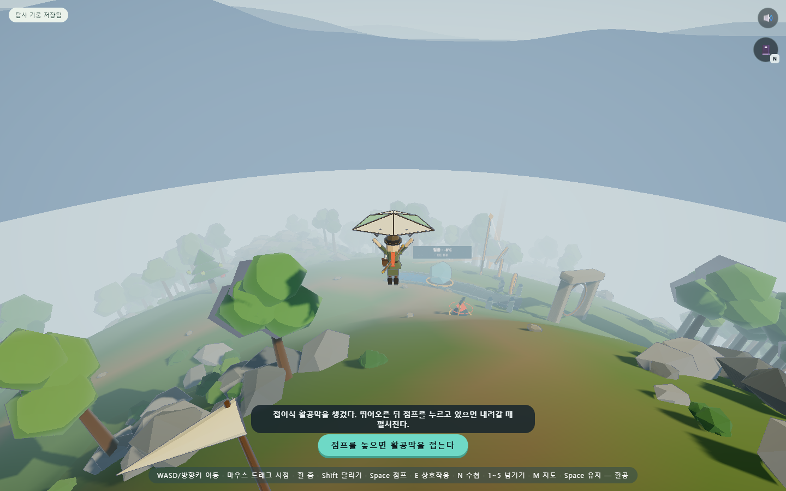
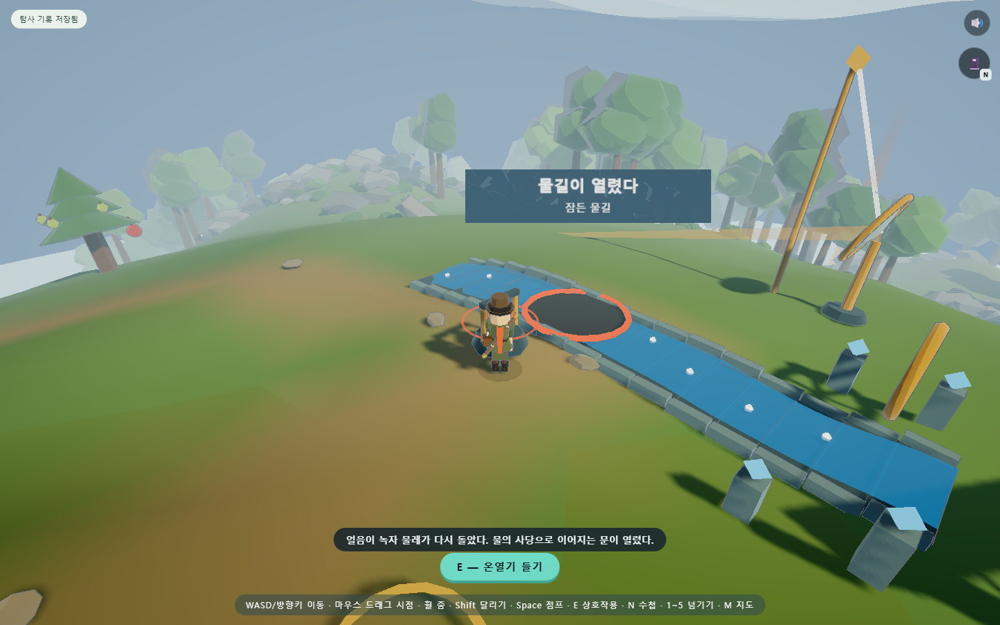

# 무무 행성 — 대표 탐험 구간 구현 보고서

작성일: 2026-09-08 · 대상: `D:\mumumetro` 로컬 작업본

## 구현 결과

승인한 [게임성·그래픽 발전 제안](ZELDA_DIRECTION.md)의 첫 단계를 실제 플레이 구간으로 구현했다. **내림판 → 바람고개 → 활공 → 얼음 수로 → 물 사당**을 연결했고, 낮은 들길로 수로까지 걸어가는 선택도 열어 두었다.

무무 행성은 작은 구형 행성에서 과학 장치를 조작하고 관찰을 수첩에 남기는 1인용 3D 웹 게임이다. 기존 연구실, 사당 6곳과 관문 17개·마지막 퍼즐 6개, 채집·요리·엔딩을 유지했다. 이번에는 야외 퍼즐 1개와 이동 장비·탐험 동선을 추가했다. 이전의 PC·모바일 수첩 아이콘과 자동 저장 개선도 포함된 상태다.

## 무엇을 바꿨는가

| 영역 | 실제 반영한 내용 |
|---|---|
| 이동 | 바람고개에서 E로 활공막 획득. 점프 홀드로 하강 중 펼치고 놓으면 접는다. 구면 위 실제 공중 고도를 유지하고 낮은 지형을 가로지른다. |
| 동작·카메라 | 씨앗 모양 천과 살대로 만든 활공막, 팔을 들고 무릎을 굽히는 자세, 착지 반응, 착지 직전 0.14초 점프 입력 버퍼. 카메라가 공중 높이를 따라가고 뒤쪽 지면 안으로 들어가지 않도록 보완했다. |
| 탐험 | 관측대·바람자루·능선길·내리막길·낮은 들길을 배치했다. 지형 높이를 바꾸지 않고 길 주변의 산포를 비워 이동 공간을 확보했다. |
| 자연 표현 | 반복 원뿔 수관을 넓은 덩어리와 키 큰 덩어리로 바꾸고, 지형·잔디의 색과 법선 이음새를 완화했다. 길은 지형 색과 잔디 높이에 같은 마스크를 사용한다. |
| 빛 | 평상시 귀환 빔과 바닥광을 낮춰 캐릭터를 가리지 않게 했다. 도착 순간 연출은 유지하고 안개·림 라이트·그늘을 조정했다. |
| 과학 퍼즐 | 온열기의 거리와 실제 반사광의 흡수판 교차가 같은 열 모형에 에너지를 전달한다. 각 장치 하나만으로도 완전히 녹일 수 있다. |
| 세계 반응 | 얼음이 줄고 하류에 물이 흐르며 물레·유적 등이 켜진다. 기존 물 사당의 내부로 들어가는 두 번째 문이 열린다. |
| 기록 | 장비, 방문 장소, 실제 사용한 해법을 수첩의 탐사 일지에 기록한다. 직접 발견한 바람고개·물길 유적만 지도에 이름이 표시된다. |
| 저장 | 새 구간의 장비·온열기 위치/운반·거울 방향·받은 열/융해·물 흐름을 저장한다. 기존 저장에 새 필드가 없어도 이어서 실행한다. |

원래 사당과 채집 지점의 위치는 유지했다. 물길을 열었다고 물 사당을 자동으로 완료하지 않는다. 새 문으로 들어갔다 나오면 수로 앞의 진입 위치로 돌아온다.

## 두 가지 해법

**온열기:** 손잡이가 달린 장치를 E로 들어 얼음 가까이 옮기고 내려놓는다. 가까울수록 전달되는 열이 커진다. 장치를 밖으로 가져가면 원래 받침으로 돌아오며 소모되는 재료는 없다.

**거울:** E로 반사 방향을 바꾸며 빛의 끝을 관찰한다. 중심 광선이 흡수판에 실제로 교차할 때만 에너지를 전달한다. 온열기를 그대로 둔 상태에서도 해결할 수 있다.

얼음은 처음 -8°C에서 시작하며, 0°C에 도달한 뒤에는 온도를 유지하면서 녹는다. 이는 열 손실·재동결·녹은 물의 추가 가열을 생략한 교육용 장치 모형이다. 가열 시간은 놀이용 출력 설정에 따른다. 두 장치를 섞어 사용해도 같은 에너지 상태에 누적된다. [상태 변화와 잠열 근거: OpenStax](https://openstax.org/books/physics/pages/11-3-phase-change-and-latent-heat)

## 검증

최종 결과 파일과 화면은 [evidence/expedition](evidence/expedition/)에 보존한다. 재현 명령은 [검사 도구 안내](../../tools/TESTING.md)에 있다.

| 검사 | 결과·범위 |
|---|---|
| 이동 코어 | 12개 통과. 높이가 일정한 구면 기준 3초 활공 25.2u/강하 4.95u, 극점 보행 오차 약 1.4×10⁻¹⁴. 고도 보존을 고의로 제거하면 실패한다. |
| 실제 탐험 경로 | 11개 통과. 내림판부터 능선길과 들길을 실제 입력으로 걸었다. 실제 활공 23.06u, 최대 지면 위 높이 7.41u, 수로 진입점 1.16u 앞에 착지했다. 움직임을 고장 내면 보행 검사가 실패한다. |
| 수로 규칙 | 27개 통과. 두 단독 해법·빗나간 광선·중간 복원·장치 반환·곡면 배치·출구 통행을 확인했다. 잘못된 융해 온도 주입을 검출한다. |
| 브라우저 퍼즐·터치 | 13개 통과. 두 단독 해결·중간/완료 복원·이전 저장 호환·사당 입출구·모바일 E·활공막 획득·실제 터치 홀드/취소 경로를 확인했다. 브라우저 실행 오류 0건. |
| 수첩 | 빈 기록 2통/완료 기록 12통, 관찰 4문장과 지도 라벨 2개를 포함해 검사했다. 폭 360/700, 높이 440/540/660, 폰트 차단 포함 초과·오류 0건. |
| 기존 내장 검사 | A~W 23개 그룹 누락 없이 모두 통과. |
| 기존 통합·예외 | 외부 호스트 차단 통합 26개, 저장·엔딩 예외 15개 통과. 브라우저 실행 오류와 요청한 로컬 자원의 누락 0건. |
| 소스·상태 | 소스 76모듈·로컬 import 203개·라이브러리 해시 19개 검사 통과. 저장 왕복, 음향 7개, 모듈 상태 복원 8개 통과. |

수첩을 열면 활공 위치·중력·수로 가열이 함께 멈추고 닫으면 이어진다. PC의 E와 모바일 화면 E로 장치를 조작하는 경로를 검사했다. 자동 조향은 목표 방향을 알고 움직이므로 일반 사용자의 길 찾기나 플레이 시간을 측정한 결과가 아니다. **이 구간이 10분 분량이라는 검증은 하지 않았다.** u는 게임의 거리 단위다.

시각 비교에서 같은 위치에 겹친 잔디 정점의 색 차이는 0.06585에서 0으로 줄었다. 수관은 그루당 54→60삼각형으로 바뀌었고, 동일 배치 비교 당시 산포 전체 삼각형은 약 1.29% 증가했다. FPS 수치는 아니며 이후 새 구간의 전체 렌더 비용과도 구분한다.

## 남은 발전 단계

1. 실제 초심자가 두 경로와 장치의 쓰임을 알아보는지 관찰하고, 발견 간격·보상·동선 길이를 조정한다.
2. 대표 사당 하나의 내부를 여러 높이의 공간과 서로 영향을 주는 장치로 확장한다. 현재 미완료 사당은 입구 체크포인트 방식이다.
3. 원경과 수관의 정밀 충돌, 지형에 따른 발 접지, 카메라의 식생 가림, 장치 집기 동작을 더 다듬는다.
4. 요리 보상을 탐험 편의와 연결하고, 낮음/보통/높음 그래픽 설정과 실제 기기 성능 측정을 진행한다.

이번 결과는 대표 구간의 첫 구현이다. 사당 전체의 입체화·등반·전투·그래픽 품질 설정까지 완료한 버전은 아니다. 실제 학교 태블릿·Safari·장시간 플레이는 별도 검증 대상이며, 공개 사이트에는 배포하지 않았다.
