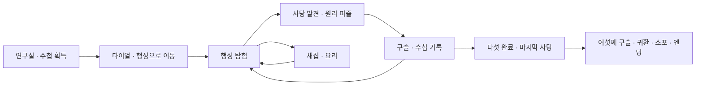

# 무무 행성 종합 분석 보고서

작성일: 2026-09-08 · 분석 대상: `D:\mumumetro` · 기준 커밋: `be9b7b47ea57ee875adfe0267be92d911092480c`

> **무무 행성은 작은 구형 행성을 탐험하며 과학 원리로 사당 퍼즐을 풀고, 채집·요리·수첩 기록을 이어 가는 1인용 3D 웹 게임이다.** 초등 4학년 과학을 소재로 기획됐으며, 주요 콘텐츠와 엔딩이 실제로 구현돼 있다. 현재 평가는 **“콘텐츠가 갖춰진 플레이 가능한 시범판, 수업 투입 전 안정화와 과학 내용 검토가 필요한 상태”**다.

## 1. 먼저 보는 결론

| 질문 | 판단 |
|---|---|
| 무엇을 하는 앱인가? | 과학 원리를 관찰하고 직접 조작해서 풀어 가는 탐험·퍼즐 게임 |
| 누구를 위한 것인가? | 프로젝트가 명시한 대상은 초등 4학년. 실제 적정 연령·독해량·조작 난도는 학생 검증 필요 |
| 실제 게임이 있는가? | 시작 화면, 연구실, 행성, 사당 6개, 일반 관문 17개, 마지막 퍼즐 6개, 채집, 요리, 수첩, 엔딩 구현 확인 |
| 가장 큰 매력은? | 탐험·과학 실험·개인 기록을 하나의 이야기로 연결한 점 |
| 바로 수업에 써도 되는가? | 교사 동반 소규모 시범 운영이 적절하다. 진행 저장, 수첩 중 일시정지, 오개념을 줄이는 문구 수정이 우선이다 |
| AI가 실시간으로 가르치는가? | 현재 실행 경로에 생성형 AI 호출은 없다. 사당의 대사와 규칙은 코드·데이터로 정해져 있다 |
| 검사 결과는? | JS 68개 문법 검사 통과. 내장 검사 A~W 중 22개 그룹 통과, M 수첩 레이아웃 그룹 실패 |

현재 가장 먼저 다룰 것은 **① 진행 저장 ② 수첩을 펼쳤을 때 입력·위험 판정 정지 ③ 과학 설명과 퍼즐 안내의 정확성 ④ 외부 라이브러리 차단 시 시작 실패**다. 다음으로 음소거, 작은 화면 레이아웃, 입력 초기화를 고치는 편이 좋다.

## 2. 이 앱에서 사용자가 하는 일

### 2.1 기본 플레이 흐름

1. **연구실에서 시작한다.** 소포를 열어 앞사람이 남긴 탐사 수첩을 얻는다.
2. **수첩을 읽어 장치를 작동시킨다.** 세 자리 다이얼에 목적지를 넣고 행성으로 이동한다.
3. **행성을 직접 돌아다닌다.** 빛기둥과 지형을 보고 사당을 찾는다. 지도는 걸어간 곳만 밝아진다.
4. **사당에서 과학 원리를 조작한다.** 저울로 비교하고, 거울을 돌리고, 혼합물을 분리하고, 온도를 바꾼다.
5. **구슬을 얻으면 세계와 수첩이 변한다.** 사당의 완료 상태가 표시되고 기록이 채워진다.
6. **탐험 중 재료를 모아 요리한다.** 흔적과 특징을 읽어 채집하고, 접시 셋의 재료를 조합한다.
7. **다섯 사당을 완료하면 마지막 사당이 열린다.** 여섯 번째 구슬 뒤에는 연구실로 돌아가 이야기를 마무리한다.



이 게임의 핵심 반복은 **“궁금한 것을 발견한다 → 직접 해 본다 → 원리를 알아낸다 → 내 기록으로 남긴다”**이다. 문제를 푸는 행동과 보상을 받는 행동이 같은 세계 안에서 이어진다.

### 2.2 기능별 실제 구현 상태

| 영역 | 확인한 구현 | 해석 |
|---|---|---|
| 구형 행성 | 구면 보행, 점프, 카메라 회전, 나무·바위 충돌, 지형과 식생 | 어느 방향으로든 이어지는 탐험 공간 |
| 연구실 | 소포, 수첩, 다이얼, 포탈, 채집 결과를 담는 병 | 튜토리얼이면서 귀환 장소 |
| 사당 | 서로 다른 장면·테마·퍼즐, 목표판, 단계별 힌트, 구슬 | 본편 진행의 중심 |
| 탐사 수첩 | 별·물음·들·편지·부엌의 5개 탭, 새 기록 표시, 닫기 버튼 | 지도·이야기·도구·수집 기록을 통합 |
| 지도 | 미탐험 구역을 가리고 방문 구역을 표시 | 정답 경로보다 탐험 이력을 보여 주는 설계 |
| 채집 | 기본 5갈래, 짐승 4종, 전설 재료 3종, 재생성 규칙 | 특징을 관찰하고 조건을 구분하는 부가 콘텐츠 |
| 요리 | 재료 11종, 레시피 6종, 접시 3개, 실패 시 재료 보존 | 채집물의 사용처와 수집 동기 |
| 사운드 | Web Audio 효과음 24종, MP3 5개, 음소거 UI | 일부 사당 음악은 파일이 아직 없음 |
| 기기 조작 | 키보드·마우스, 터치 이동·시점, 점프·상호작용·수첩 버튼 | 모바일 입력 경로가 실제로 존재 |
| 이야기 종료 | 여섯 구슬 → 연구실 소포 → 마지막 대사 → 끝 카드 | 상태를 준비한 통합 검증에서 연결 확인 |
| 장기 진행 | 메모리 안에서 완료 상태와 소지품 유지 | 새로고침·재방문 후 이어하기는 없음 |

근거: [게임 조립과 진행](D:/mumumetro/src/boot.js), [채집 규칙](D:/mumumetro/src/data/forage.js), [레시피](D:/mumumetro/src/data/recipes.js), [수첩](D:/mumumetro/src/ui/Notebook.js).

### 2.3 사당 여섯의 실제 구성

| 사당 | 소재 | 일반 관문 | 마지막 퍼즐 | 주로 쓰는 사고 |
|---|---|---|---|---|
| 균형 | 물체의 무게 | 무게 순서, 무게 압력판 | 양팔저울 수평 맞추기 | 비교, 순서화, 조합 |
| 그림자 | 그림자와 거울 | 그림자 밟기, 거울 세 장, 그림자 크기 | 그림자의 방향·길이 조절 | 공간 추론, 원인과 결과 |
| 체 | 혼합물의 분리 | 체 고르기, 성질로 나누기, 거름과 증발 | 혼합물에 도구와 처리 순서 적용 | 분류 기준, 절차 구성 |
| 세 모습 | 물의 상태 변화 | 얼려서 건너기, 미끄러운 바닥, 수증기 승강기 | 온도 조절 후 상태 확인 | 상태 변화, 조건 대응 |
| 흔들리는 | 화산과 지진 | 예진, 용암 육각형, 간헐천 | 흔들림을 보며 수로 조정 | 신호 관찰, 이동 타이밍 |
| 시간 | 지층과 화석 | 층의 순서, 내려가는 갱도, 다섯 색의 문 | 구슬과 제단 표지 짝짓기 | 순서 추론, 기록 활용 |

**실제 일반 관문 수는 17개다.** 균형의 사당은 일반 관문이 2개이고 나머지는 3개다. 마지막 퍼즐 6개까지 합치면 목표가 있는 구역은 23개다. README의 “관문 18”과 다르다. 여섯 사당 모두 실행 시 `open: true`인 하늘의 섬 형태로 만들어졌고, 임시 대체 관문인 `TodoGate`·`TodoGod`은 이 구성에서 사용되지 않았다.

근거: [사당 배치](D:/mumumetro/src/shrine/layouts.js), [브라우저에서 확인한 관문 클래스](D:/mumumetro/reports/2026-09-08/evidence/browser-audit.json).

### 2.4 이야기와 정체성 — 엔딩 내용 포함

앞사람은 정답 대신 질문을 남겼고, 플레이어는 탐험을 통해 그 질문을 자기 경험으로 채운다. 마지막에는 자신도 답을 적은 장을 뜯어내고 다음 사람에게 질문을 남긴다. **“남의 답을 읽는 것과 직접 아는 것은 다르다”**는 주제가 오프닝·수첩·엔딩을 묶는다.

이 이야기 구조는 앱의 가장 분명한 개성이다. 향후 기능을 늘리더라도 수첩이 단순한 완료 목록으로만 바뀌지 않도록 유지할 가치가 있다. 근거: [대사와 엔딩](D:/mumumetro/src/shrine/dialogue.js:99).

## 3. 제품·게임 설계 평가

### 잘 작동하는 설계

- **원리를 행동으로 옮겼다.** 무게 순서 방은 외형만 믿기 어렵게 만들고 비교 저울을 쓰게 한다. 체의 사당은 도구 선택뿐 아니라 처리 순서까지 묻는다.
- **조작이 일관된다.** 위치를 옮겨 대상을 고르고 E로 상호작용한다. 연구실에서 배운 손동작이 사당과 부엌에서도 쓰인다.
- **틀린 뒤 다시 시도하기 쉽다.** 방 단위 복귀와 재료 보존 규칙이 있다. 오답 이유를 말해 주는 구조도 확인했다.
- **기록에 실제 용도가 있다.** 수첩은 지도와 이야기뿐 아니라 마지막 구역의 표지를 확인하는 도구다.
- **기술적 문제를 검사로 남겼다.** 극점 이동, 통로 이음매, 손이 닿는 거리, 수첩 크기 등 실제 플레이를 방해하는 조건을 수치로 검사한다.

### 개선이 필요한 설계

**수업 시간과 자유 탐험의 접점을 더 정해야 한다.** 화살표를 없애고 방문한 곳만 보여 주는 지도는 탐험에 잘 맞는다. 다만 제한된 수업에서 특정 원리를 다뤄야 할 때에는 시작 지점·소요 시간·교사 안내가 필요하다. 일반 탐험 모드를 유지하면서 교사가 지정한 사당에서 시작하는 수업용 진입 방식을 검토할 수 있다.

**사고 난도와 조작 난도가 섞여 있다.** 얼음, 낙석, 간헐천, 용암은 개념을 알아도 조작에 실패할 수 있다. 현재 난이도는 완료한 사당 수를 사용하므로 학생이 실제로 이해했는지에 맞춘 적응형 난이도는 아니다. 수업용으로는 이동 관문의 속도 완화·재시도 지원을 별도로 두는 것이 적절하다.

**재플레이 약속은 범위를 줄여야 한다.** 여러 관문에서 배치와 주문이 바뀌지만, 양팔저울의 목표는 `3kg × 2칸`으로 고정돼 있다. “모든 정답이 매번 바뀐다”보다 “여러 관문의 배치와 주문이 달라진다”가 현재 구현에 맞다. 근거: [고정 저울 목표](D:/mumumetro/src/shrine/Scale.js:32).

**사당의 공간은 열린 외관과 선형 진행을 함께 가진다.** 하늘·색·실루엣은 다르지만, 공통 배치 함수는 방을 한 줄로 잇는다. 유지보수에는 유리하다. 다만 탐험의 다양성을 높이려면 색 변경에 더해 돌아보기, 앞의 장치를 다시 쓰기, 같은 원리의 다른 해법 같은 공간적 변화를 추가할 수 있다.

### 레퍼런스와의 비교

Nintendo의 공식 『젤다의 전설 티어스 오브 더 킹덤』 안내는 사당에서 능력을 얻고, 주변 환경을 관찰하며 퍼즐을 해결하는 흐름을 설명한다. 무무 행성도 공간 관찰과 직접 조작을 진행에 연결한다. 다만 현재는 대부분 정해진 대상·자리·판정에 맞추는 방식이다. **같은 원리를 다음 방이나 야외에서 다시 써 보는 과제**가 늘어나면 학습과 탐험의 연결이 더 선명해질 것이라는 분석이다. [Nintendo 공식 안내](https://play.nintendo.com/news-tips/tips-tricks/tears-of-the-kingdom-tips-tricks/)

## 4. 교육적 타당성과 과학 내용

### 4.1 교육 효과는 아직 검증된 것으로 볼 수 없다

비교·분류·관찰·변인 조절을 요구하는 활동은 있다. 그러나 현재 저장소에는 학생 사전·사후 검사, 개념 설명 응답, 실제 사용 결과, 교사 관찰 자료가 없다. 사당 완료는 **게임 과제를 끝냈다는 증거**이며, 해당 단원을 이해했다는 증거로 쓰려면 추가 평가가 필요하다.

수업에서는 사당 하나를 마친 뒤 “무엇을 바꿨고 무엇이 달라졌나?”, “다른 상황에서도 같은 방법이 될까?”를 말이나 짧은 글로 남기게 하는 편이 좋다. 수첩 자동 기록에 학생 자신의 설명을 덧붙일 수 있으면 제품의 주제와도 잘 맞는다.

### 4.2 현재 교육과정과의 대응은 별도 확인이 필요하다

README는 “과학 4학년은 단원이 정확히 여섯”이며 각 단원을 통째로 다룬다고 설명한다. 그러나 교육부 고시에 따르면 초등학교 3·4학년은 **2025년부터 2022 개정 교육과정 적용 대상**이다. 현재 저장소에는 교육과정 버전, 교과서 출판사, 성취기준 코드와 게임 활동을 대응한 자료가 없다. 따라서 이 보고서는 “현재 4학년 과학 전체 단원을 충족한다”고 판정하지 않는다. [교육부 교육과정 고시](https://www.moe.go.kr/boardCnts/viewRenew.do?boardID=141&boardSeq=93458&lev=0&m=040401)

권장 문구는 우선 **“초등 과학의 여섯 주제를 탐험하는 게임”**이다. 이후 `교육과정 버전 → 학년군·성취기준 → 해당 퍼즐 → 확인할 학습 결과`의 대응표를 작성해야 한다. 이번 분석에서는 교과서별 전체 단원 대조까지 완료하지 않았다.

### 4.3 우선 검토할 과학 표현

| 항목 | 현재 표현·동작 | 문제와 권장 방향 |
|---|---|---|
| 지진 전조 | “크게 흔들리기 전에 반드시 작게 먼저 흔들린다” | 실제 지진의 보편 법칙으로 읽힐 수 있다. 사당 장치가 내는 **게임 속 경고 신호**로 명명하고 현실 지진 설명과 구분 |
| 물의 온도 | “온도 올리기”를 누르면 세 상태가 순환하며 마지막에는 낮은 온도로 돌아감 | 조작 이름과 결과가 어긋난다. “온도 단계 바꾸기”로 고치거나 가열·냉각을 구분 |
| 저울 | 무게와 거리의 곱을 사용하는 목표 | 게임 확장 과제로는 가능하나, 대상 성취기준과 선수 지식 확인 필요 |
| 채집 규칙 | 가상 행성의 버섯·풀 판별 규칙 | 코드에는 가상 생물이라는 의도가 있다. 학생 화면에서도 그 범위가 분명한지 확인 필요 |

지진 관련 판단의 근거는 USGS의 설명이다. 작은 지진은 더 큰 지진이 발생한 뒤에야 전진으로 분류할 수 있으며, 모든 본진에 전진이 있는 것도 아니다. 따라서 항상 예고가 있는 게임 규칙을 실제 지진 지식으로 전달하는 문구는 수정 우선순위가 높다. [USGS 전진·여진 설명](https://www.usgs.gov/faqs/foreshocks-aftershocks-whats-difference?items_per_page=6&os=v0&page=1), [USGS 지진 교육 자료](https://pubs.usgs.gov/of/2011/1158/ofr2011-1158v1.1.pdf)

코드 근거: [지진 방 힌트](D:/mumumetro/src/shrine/layouts.js:174), [지진 판정](D:/mumumetro/src/shrine/FireGates.js:82), [온도 조절](D:/mumumetro/src/shrine/WaterGates.js:450).

## 5. 기술 구조와 유지보수 상태

### 5.1 구조

```text
index.html                 진입 화면 · importmap · 기본 안내
src/boot.js                시작/연구실/행성/사당 모드와 게임 진행 조립
src/core/                  렌더 엔진 · 입력 · 프레임 루프 · 오디오
src/sphere/                지형 · 구면 좌표 · 플레이어 이동과 캐릭터
src/render/                툰 셰이딩 · 하늘 · 화면 후처리
src/world/                 사당 외형 · 식생 · 연구실 · 채집 · 부엌
src/shrine/                사당 배치 · 내부 조립 · 관문 · 마지막 퍼즐
src/ui/                    수첩 · 지도 · 대사 · 터치 · 안내
src/data/                  색 테마 · 표지 · 재료 · 레시피 · 효과음
src/debug/introspect.js     런타임 계측 · 내장 회귀 검사
tools/                     정적 서버 · 개발용 모델 생성/압축 도구
```

Three.js r160과 순수 JavaScript ES 모듈을 사용한다. 별도 빌드 없이 정적 서버에서 실행된다. 행성·연구실·사당은 장면을 전환하며, 사당은 처음 필요할 때 만들어 메모리에 보관한다. 전용 강체 물리 엔진 대신 구면 이동, 충돌 밀어내기, 저울 토크 등을 직접 계산한다.

서버 API·DB·로그인·결제·교사용 대시보드·학생 계정은 현재 실행 구조에서 확인되지 않았다. `tools/meshy_gen.py`는 개발자가 3D 에셋을 만드는 도구이며, 플레이 중 학생에게 답변하는 AI 기능은 아니다.

### 5.2 측정한 규모

| 지표 | 결과 | 해석 범위 |
|---|---:|---|
| `src`의 JS 파일 | 68개 | 전체 파일 목록 기준 |
| JS 물리적 줄 수 | 15,380줄 | 주석·빈 줄 포함, 복잡도 점수 아님 |
| 진입점에서 import로 연결된 파일 | 58개 | 문자열 기반 import 그래프, 함수별 실제 호출 여부와는 다름 |
| 연결되지 않은 JS | 10개 | 옛 문제은행 9개, `core/Assets.js` |
| 지형 삼각형 | 27,380개 | 런타임 지형 geometry 기준 |
| 식생 등 산포 메시 | 139개 | 현 실행 로그 기준 |
| MP3 | 5개 / 약 9.42MB | 저장소 파일 크기 합계 |
| GLB | 31개 / 약 3.20MB | 현 감사 경로에서 GLB 네트워크 요청은 0회 |
| 행성 렌더 1프레임 | 613회 draw call / 731,515개 삼각형 제출 | 그림자·외곽선·후처리 등 패스 합계, 장면 위치 의존 |

렌더 계측에서는 `renderer.info.autoReset=false`로 한 번의 전체 `engine.render()`를 집계했다. 기본 통계는 후처리의 마지막 패스만 보여 줄 수 있어 그대로 사용하지 않았다. 이 수치만으로 실기기 FPS나 병목을 단정하지 않는다. 학교 태블릿의 30FPS 유지 여부·발열·배터리 사용은 별도 측정이 필요하다.

근거: [정적 계측](D:/mumumetro/reports/2026-09-08/evidence/static-audit.json), [렌더 계측](D:/mumumetro/reports/2026-09-08/evidence/focused-audit.json).

### 5.3 유지보수의 장점과 부담

**장점:** 배치·색 테마·대사·레시피를 데이터로 분리했고, 관문들은 비슷한 호출 규약을 따른다. 구면 이동과 실내 이동도 분리돼 있다. 기존 동작을 보존하며 퍼즐을 추가하거나 수정하기 좋은 뼈대다.

**부담:** `boot.js`는 904줄로 입력·전환·보상·이야기·음악을 함께 다루며, `introspect.js`는 1,311줄이다. 데이터와 구현을 분리한 만큼 둘의 내용이 서로 맞는지도 검사해야 한다. 실제로 안내가 옛 동작을 설명하는 사례가 남아 있다.

쓰지 않는 `core/Assets.js`는 존재하지 않는 `../rendering/Toon.js`를 import한다. 현재 앱 실행에는 연결되지 않아 시작 오류의 원인은 아니다. 향후 모델 로더를 다시 사용할 때 터질 수 있는 **잠재 결함**이다. 기존 GLB를 정리한다면 삭제부터 하지 말고 사용 여부와 보관 목적을 먼저 기록하는 편이 좋다.

## 6. 실제 검증 결과

### 6.1 검증 환경과 범위

- Windows의 로컬 정적 서버, Edge Chromium `152.0.4191.66` 헤드리스 브라우저.
- 데스크톱 `1365×900`, 좁은 화면 `390×844`, 터치·모바일 에뮬레이션.
- 전체 JS 문법 검사, import 연결과 누락 검사, 내장 `__selftest()` 실행.
- 사당 6개의 장면 생성·진입, 화면 캡처, HTTP 오류 수집.
- 새로고침, 키보드 입력, 창 포커스 상실, 수첩, 음악 전환·음소거의 표적 재현.
- 폰트 CDN 차단, Three.js CDN 차단 조건 검증.
- 완료 상태와 위치를 준비한 뒤 여섯째 구슬 획득부터 소포·끝 카드까지 통합 검증.

**전체 퍼즐을 일반 플레이어처럼 처음부터 끝까지 풀어 낸 완주 검사는 아니다.** 일부 검사는 위치·완료 상태를 직접 준비했다. 내장 F 검사는 문을 열고 장애물을 제외한 상태로 통로 이음매를 확인한다. 따라서 F 통과를 모든 퍼즐·장애물의 완주 보장으로 해석하면 안 된다. 공개 배포 주소의 실제 동작·로컬 코드와의 동일성도 확인하지 못했다.

### 6.2 결과 요약

| 검사 | 결과 |
|---|---|
| JS 68개 문법 | 모두 통과 |
| 현재 import 경로 | 진입 경로의 누락 없음. 사용하지 않는 Assets.js에 잘못된 상대 경로 1개 |
| 초기 화면·연구실·행성·사당 6개 | 생성 및 화면 출력 확인, 해당 감사 실행에서 처리되지 않은 JS 오류 0개 |
| 내장 A~W | 23개 그룹 실행. 22개 그룹 통과, M 실패. 세부 출력은 실행 여부 검사 포함 28줄 |
| 구면 보행 | 표면 밀착 최대 편차 `8.53e-14`, 극점 통과 `3.88e-12` |
| 통로·카메라 | F·G·H 통과. 앞서 설명한 검사 조건 안에서의 결과 |
| 작은 수첩 | 채워진 상태 `360×440`에서 물음 +5px, 부엌 +6px 넘침. 폰트 차단 조건에서도 같은 실패 |
| 새로고침 | 사당 완료 `1 → 0`, 수첩 보유 `true → false` |
| 터치 수첩 | 터치 UI 표시, 수첩 열림, 보이는 X 버튼으로 닫기 확인 |
| 음악 자원 | sift·water·fire·strata MP3 404. 게임 루프는 계속 실행 |
| 엔딩 통합 | 완료 6개, `gameDone=true`, 소포 발송 상태와 실제 끝 카드 확인 |
| Three.js CDN 차단 | `window.game` 생성 안 됨. “행성을 빚는 중…” 화면에 머묾 |

`__none__.mp3`의 404는 내장 W 검사가 고의로 만든 것으로, 누락된 실제 사당 음악 4개와 구분했다.

검증 도구의 첫 실행에서는 시작 문구의 지속 애니메이션 때문에 Playwright의 안정 상태 대기가 시간 초과됐다. 고정된 시작 화면 영역을 클릭해 검증을 계속했다. 이것은 **게임 시작 불가 결함으로 집계하지 않았다.** 또한 초기 모바일 기록의 빈 버튼 배열은 감사 코드가 `#notebook`이라는 잘못된 선택자를 쓴 결과다. 후속 검사에서 실제 `#nb`의 버튼 6개와 닫기를 확인했다.

### 6.3 화면 근거

시작 화면: 캐릭터와 사당을 실시간 3D 장면으로 보여 준다.


물의 사당: 열린 공간에 목표판과 관문을 배치했다.


추가 화면: [연구실](D:/mumumetro/reports/2026-09-08/evidence/02-lab-desktop.png), [좁은 시작 화면](D:/mumumetro/reports/2026-09-08/evidence/04-title-narrow.png), [모바일 수첩](D:/mumumetro/reports/2026-09-08/evidence/05-notebook-mobile.png), [상태를 준비해 확인한 끝 카드](D:/mumumetro/reports/2026-09-08/evidence/06-ending-staged.png).

## 7. 발견 사항과 수정 우선순위

P1은 수업용 공개 범위를 넓히기 전에 해결할 항목, P2는 다음 안정화 작업, P3는 정리·일관성 개선을 뜻한다. 아래 우선순위는 영향에 대한 분석자의 판단이다.

| ID | 우선순위 | 발견 사항 | 근거 수준 |
|---|---|---|---|
| F01 | P1 | 진행 저장이 없어 새로고침하면 수첩·사당 완료 기록 소실 | 실행 재현 |
| F02 | P1 | 수첩을 펼쳐도 이동 입력과 위험 요소 시간이 계속 진행 | 실제 키보드 입력·시간 변화 재현 |
| F03 | P1 | 항상 지진 전조가 온다는 문구가 과학 오개념을 유도할 수 있음 | 화면 데이터·판정 코드·공식 과학 자료 대조 |
| F04 | P1 | Three.js CDN 차단 시 시작 실패, 대기 화면에 머묾 | 네트워크 차단 재현 |
| F05 | P2 | 음악 페이드인 도중 음소거하면 음량이 다시 올라옴 | 미디어 요소 상태 재현 |
| F06 | P2 | 물·시간 신전의 힌트가 실제 풀이 규칙과 다름 | 런타임 힌트·구현 대조 |
| F07 | P2 | 작은 수첩 레이아웃 검사 실패 | 일반·폰트 차단 조건 재현 |
| F08 | P2 | 창 포커스를 잃을 때 눌린 키를 초기화하지 않음 | blur 이벤트 후 입력 유지 재현 |
| F09 | P2 | 사당 4개의 배경음악 파일 누락 | 실제 HTTP 404 |
| F10 | P3 | 첫 클릭으로 연구실에 들어가도 시작 화면 음악이 최종 재생됨 | 음원 요청 순서·재생 상태 재현 |
| F11 | P3 | 제작자 링크를 누르는 순간 게임도 시작됨 | 링크 pointerdown 전달 재현 |
| F12 | P3 | README의 관문 수·줄 수·검사 수·렌더 수치가 현재와 다름 | 파일·런타임 계측 대조 |
| F13 | P3 | 쓰지 않는 모델 로더의 import 경로가 잘못됨 | 정적 검사, 현재 실행 영향 없음 |

### F01. 이어하기가 없다

`rooms`, 사당 완료, 수첩, 채집 상태가 메모리에만 존재한다. 테스트용 상태로 완료 1개와 수첩 보유를 만들고 새로고침하니 둘 다 초기화됐다. 잠시 중단했다가 돌아오는 학습 흐름을 지원하지 못한다.

권장: 기기 안에 버전이 있는 저장 데이터를 두고, 사당 완료·수첩·재료·요리·지도 탐험·연구실 진행을 저장한다. “계속하기/새로 시작”과 기존 저장 데이터 호환 정책을 함께 설계한다. 우선 계정 서버 없이도 구현 가능하다. [상태 생성 위치](D:/mumumetro/src/boot.js:123), [재현 기록](D:/mumumetro/reports/2026-09-08/evidence/browser-audit.json)

### F02. 수첩을 읽는 동안에도 게임이 진행된다

수첩을 연 채 실제 W 키 입력 후 20프레임을 진행했더니 캐릭터가 `z=10 → 8.8`로 1.2u 이동했다. 같은 조건에서 지진 관문의 시계도 `0 → 0.05` 증가했다. 위험 구역에서 기록을 읽는 행동이 실패로 이어질 수 있는 구조다.

권장: 수첩·지도 같은 전면 화면을 열면 이동·상호작용을 막고 위험 판정 시간을 멈춘다. 열고 닫을 때 남은 키·터치 입력도 비운다. 장식 애니메이션을 계속 돌릴지는 별도로 결정한다. [입력 소비](D:/mumumetro/src/boot.js:326), [관문 갱신](D:/mumumetro/src/boot.js:626), [수첩 열기](D:/mumumetro/src/ui/Notebook.js:524), [실제 키보드 재현](D:/mumumetro/reports/2026-09-08/evidence/flow-audit.json)

### F04. 필수 외부 모듈을 못 받으면 대기 상태로 남는다

Three.js를 jsDelivr에서 직접 받아 시작한다. 해당 도메인을 차단하자 게임 객체가 만들어지지 않았고 로딩 문구가 그대로 남았다. 폰트와 음악이 없어도 실행되는 설계와 달리, 필수 엔진 파일에는 대체 경로가 없다.

권장: 현재 버전을 프로젝트와 함께 제공하거나 같은 출처에서 서비스한다. 로딩 시간 초과·재시도·연결 오류 안내도 둔다. 캐시와 오프라인 지원은 이 작업 뒤에 검토한다. [importmap](D:/mumumetro/index.html:104), [차단 재현](D:/mumumetro/reports/2026-09-08/evidence/focused-audit.json)

### F05. 음소거 상태와 실제 음악 음량이 어긋난다

배경음악을 바꾸고 100ms 뒤 음소거했다. 즉시 음량은 0이 됐지만, 페이드인이 끝난 뒤에는 `isMuted()=true`인 채 미디어 요소의 `volume=0.5`, `paused=false`가 됐다. 물리 스피커의 소리를 녹음한 검사는 아니지만 재생 상태와 음량 속성의 불일치는 확인됐다.

원인은 페이드 함수가 시작 당시 목표 음량을 계속 적용하고, 음소거는 현재 음량만 바꾸는 데 있다. 진행 중인 전환에도 현재 음소거 상태를 반영해야 한다. 내장 W 검사는 boolean만 확인하므로 이 결함을 놓친다. [페이드인](D:/mumumetro/src/core/Audio.js:115), [음소거](D:/mumumetro/src/core/Audio.js:137), [W 검사](D:/mumumetro/src/debug/introspect.js:1279)

### F06. 퍼즐을 고쳤지만 힌트가 따라오지 않았다

물의 신은 손잡이로 온도를 바꾸어야 한다. 10초 동안 `update()`해도 상태는 그대로였지만 힌트에는 “신이 바뀌는 걸 한 바퀴 지켜봐라”가 남아 있다. 조작 안내 종류도 `time`으로 남아 있다.

시간의 신은 구슬과 제단의 표지가 맞아야 받는데 힌트에는 “아무 제단에나 올려도 된다”가 남아 있다. 두 경우 모두 헤매는 학생에게 잘못된 행동을 권한다.

권장: 목표·힌트·조작 안내를 현재 규칙에 맞춰 함께 수정한다. 구현의 정답 판정뿐 아니라 “힌트대로 행동해도 풀이에 접근할 수 있는가”를 검증해야 한다. [물 신전 힌트](D:/mumumetro/src/shrine/layouts.js:157), [시간 신전 힌트](D:/mumumetro/src/shrine/layouts.js:211), [시간 신전 정답 판정](D:/mumumetro/src/shrine/StrataGates.js:409)

### F07~F13. 함께 정리할 항목

- **수첩 넘침:** 5~6px의 작은 초과이며 모든 내용을 못 읽는 장애로 확인된 것은 아니다. 넘침을 허용하는 스크롤 대비책과 “스크롤 없음” 검사 기준을 함께 검토한다.
- **키 입력 유지:** `blur`에서 키·점프·액션·터치 상태를 초기화한다. 실제 OS 전환 조합별 검증은 추가로 필요하다. [입력 처리](D:/mumumetro/src/core/Input.js:18)
- **음악 누락:** 사당 테마별 파일을 채우거나 존재하는 트랙으로 명시적 대체한다. 404 때문에 게임이 멈추지는 않았다.
- **첫 음악:** 첫 클릭이 연구실 음악을 요청한 뒤 전역 pointerdown이 시작 화면 음악을 다시 요청한다. 음악 전환과 오디오 시작의 처리 순서를 정리한다. [시작 처리](D:/mumumetro/src/boot.js:467), [첫 제스처](D:/mumumetro/src/boot.js:895)
- **제작자 링크:** 링크는 click만 전파를 막고 게임은 pointerdown으로 시작한다. 같은 이벤트 단계에서 분리해야 한다. [Title.js](D:/mumumetro/src/ui/Title.js:111)
- **README:** `boot.js 337줄 → 904줄`, `관문 18 → 17`, `검사 10항목 → A~W 23개 그룹`, `산포 141메시 → 현 실행 139메시`. 고정 목표가 있는 점과 열린 사당의 안내판 설명도 갱신한다.
- **옛 로더:** `rendering/Toon.js`를 참조하는 미사용 로더는 다시 연결하기 전에 수정한다. [Assets.js](D:/mumumetro/src/core/Assets.js:4)

## 8. 권장 실행 순서와 완료 기준

| 단계 | 작업 묶음 | 완료됐다고 판단할 기준 |
|---|---|---|
| 1. 안내·교육 내용 | 물·시간 신전 힌트, 지진 표현, 온도 버튼 이름, 교육과정 표기 | 실제 조작과 안내가 일치하고 교사가 과학 표현을 검토함 |
| 2. 중단·복귀 안정성 | 저장·계속하기, 수첩 일시정지, 포커스 상실 입력 초기화 | 새로고침 후 기록 복구, 수첩 중 이동·위험 판정 없음, 복귀 시 키 고착 없음 |
| 3. 기기·네트워크 | 필수 모듈 자체 제공, 음소거, 누락 음악, 작은 화면 | CDN 차단 조건에서 실행, 전환 도중에도 음량 0 유지, 필수 요청 404 없음, M 검사 통과 |
| 4. 수업용 검증 | 사당별 학습 목표·확인 질문, 교사 안내, 학생 시범 사용 | 개념 이해와 조작 실패를 구분한 관찰 기록 확보 |
| 5. 확장·정리 | README 갱신, 검사 실행 자동화, 저장 구조와 진행 코드 분리 | 단일 실행으로 검사 결과 확인, 문서 수치가 자동 계측과 일치 |

학생 시범 사용에서는 첫 소포를 찾는 시간, 포탈을 여는 데 필요한 도움, 사당별 시도·힌트·중단 지점, 개념 설명의 변화를 관찰하는 것이 유용하다. 아직 측정하지 않은 전체 플레이 시간이나 학습 향상률을 홍보 수치로 제시해서는 안 된다.

현재 구조를 전면 교체할 필요는 확인되지 않았다. 기존 데이터 중심 구조를 유지하면서 진행 상태와 UI 중단 정책을 정리하는 쪽이 비용 대비 효과가 크다. 교사용 기능이나 계정은 수업 운영 요구가 확인된 뒤 추가해도 된다.

## 9. 분석 자료와 재현 방법

이번 작업은 게임 코드를 수정하지 않고 `reports/`에 보고서·검증 코드·결과·화면만 추가했다. 처음부터 있던 파일을 삭제하거나 되돌리지 않았다.

| 자료 | 내용 |
|---|---|
| [정적 검사 JSON](D:/mumumetro/reports/2026-09-08/evidence/static-audit.json) | 파일 수, 줄 수, import 연결, 자원 크기, 문법 결과 |
| [기본 브라우저 검사 JSON](D:/mumumetro/reports/2026-09-08/evidence/browser-audit.json) | 콘솔, 내장 검사, 사당 생성, 404, 새로고침 결과 |
| [표적 재현 JSON](D:/mumumetro/reports/2026-09-08/evidence/focused-audit.json) | 음악·음소거·수첩·입력·렌더·CDN 차단 |
| [입력·엔딩 통합 JSON](D:/mumumetro/reports/2026-09-08/evidence/flow-audit.json) | 실제 W 입력, 마지막 구슬부터 끝 카드, 터치 닫기 |
| [정적 검사 스크립트](D:/mumumetro/reports/2026-09-08/evidence/static-audit.py) | Python + Node로 재현 |
| [기본 브라우저 스크립트](D:/mumumetro/reports/2026-09-08/evidence/browser-audit.cjs) | Playwright + Edge로 재현 |
| [표적 재현 스크립트](D:/mumumetro/reports/2026-09-08/evidence/focused-audit.cjs) | 별도 임시 브라우저 상태에서 재현 |
| [통합 확인 스크립트](D:/mumumetro/reports/2026-09-08/evidence/flow-audit.cjs) | 상태를 준비한 엔딩 연결·입력 확인 |

프로젝트 폴더에서 서버를 실행한 뒤, 다른 터미널에서 검사를 실행한다. 브라우저 검사는 사용자의 기존 탭·플레이 기록과 분리된 임시 컨텍스트를 사용한다.

```powershell
python tools/serve.py 5500
```

```powershell
python reports/2026-09-08/evidence/static-audit.py
$env:AUDIT_NODE_MODULES = 'C:/Users/닭사랑농장/.cache/codex-runtimes/codex-primary-runtime/dependencies/node/node_modules'
node reports/2026-09-08/evidence/browser-audit.cjs
node reports/2026-09-08/evidence/focused-audit.cjs
node reports/2026-09-08/evidence/flow-audit.cjs
```

다른 컴퓨터에서는 `AUDIT_NODE_MODULES`를 Playwright가 설치된 `node_modules` 경로로 바꾸고 Edge를 준비해야 한다. 서버 주소를 바꿀 때에는 `AUDIT_URL`을 설정한다. 스크립트는 진단 자료를 작성하는 감사 도구이며 실패 시 자동으로 CI를 차단하는 검사 구성은 아니다.

남은 검증 범위는 **실제 초등학생 사용성, 학교 태블릿·Safari·인앱 브라우저, 장시간 성능, 일반 조작만으로의 전체 완주, 교육과정 성취기준 전체 대응, 공개 배포판 검증**이다.
