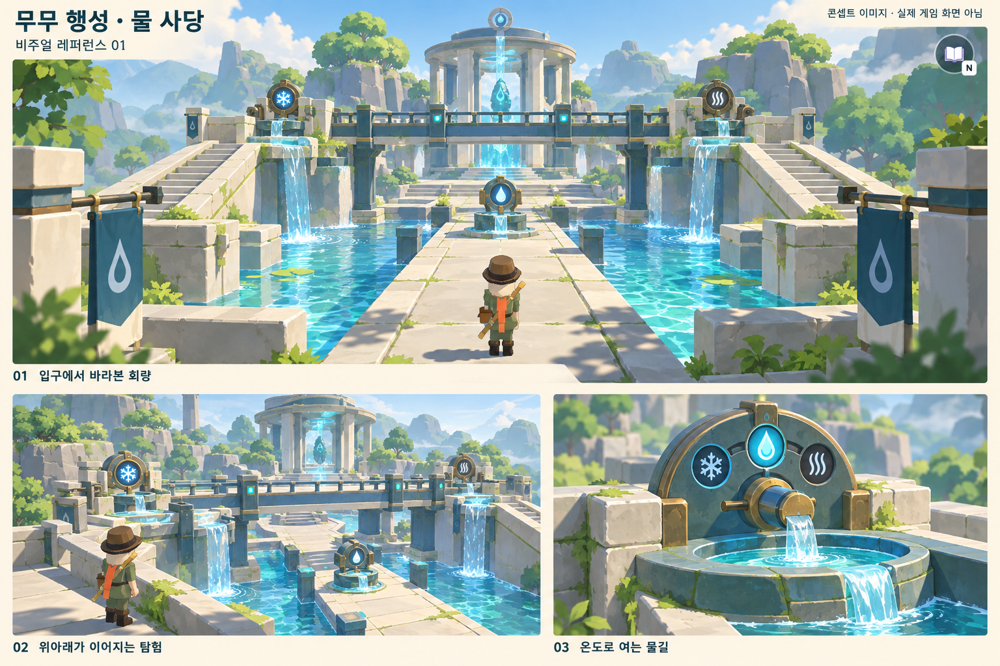

# 물 사당 비주얼 레퍼런스 01

2026-09-08 · 구현 전 미술 목표 · 사용자 검토용 첫 시안

사용자의 의견에 따라 **레퍼런스 이미지 → 공간 시제품 → 같은 시점의 실제 화면 비교 → 디테일 구현** 순서로 진행한다. 이번 산출물은 물 사당의 목표 이미지이며, 화면 속 그래픽과 입체 동선이 게임에 적용됐다는 뜻은 아니다.

## 이 시안에서 잡은 방향

| 항목 | 목표 | 구현 화면에서 확인할 것 |
|---|---|---|
| 색과 빛 | 따뜻한 밝은 돌, 청록색 물, 시원한 그늘 | 회색 안개에 주요 장치와 길이 묻히지 않는가 |
| 공간 | 낮은 중앙 돌길과 양쪽 높은 회랑, 위를 잇는 다리 | 입구에서 올라갈 길·건널 길·목적지가 읽히는가 |
| 물의 표현 | 수면의 반짝임, 얇은 폭포, 작동 후 흐르는 물 | 물과 보행 바닥이 구분되고 장치 반응이 보이는가 |
| 퍼즐 장치 | 얼음·물·수증기 문양과 공통된 온도 손잡이 | 가까이 가기 전 장치를 발견하고, 조작 후 변화를 이해할 수 있는가 |
| 캐릭터 | 기존 갈색 모자·올리브색 옷·주황 목도리의 탐험가 | 작은 화면에서도 몸과 배경이 분리되는가 |
| 인터페이스 | 오른쪽 위 수첩 아이콘과 PC N 표시 | 배경이 밝아도 읽히고, 기존 버튼으로 실제 수첩이 열리는가 |

젤다풍에서 가져올 방향은 맑은 자연광, 간결한 형태, 멀리 보이는 목적지, 눈으로 읽는 탐험이다. 기존 탐험가와 과학 퍼즐의 정체성은 이어간다.

## 이미지와 설계를 구분할 부분

- 이미지의 계단은 시각적 제안이다. 실제 이동면은 완만한 경사로로 먼저 만들고, 계단 장식은 발 걸림과 카메라 흔들림을 확인한 뒤 더한다.
- 위 다리와 아래 돌길은 동시에 통행할 수 있어야 한다. 이미지의 외형만으로 충돌·머리 위 여유가 검증된 것은 아니다.
- 세 밸브의 위치와 시점별 배치는 미술 구상이다. 세 번째 방의 치수와 정상적인 퍼즐 동선을 기준으로 배치를 확정한다.
- 눈송이·물방울·증기 문양은 상태 표지다. 증기 효과나 푸른 물줄기는 과학적 판정 대신 사용하는 연출이 아니다. 기존 온도와 상태 규칙에 반응하도록 연결한다.
- 작은 이끼, 줄눈, 반사와 먼 산은 형태·색·조명·보행을 검증한 뒤 추가한다. 이미지 수준의 세부 표현이나 기기별 성능은 아직 검증하지 않았다.

## 다음 구현 순서와 비교 기준

1. **형태:** 중앙 돌길, 좌우 경사로, 높은 회랑, 연결 다리, 신전의 실루엣만 배치한다. 입구와 회랑 위에서 이미지를 비교한다.
2. **보행과 퍼즐:** 실제 입력으로 좌우에 올라가고, 첫 밸브로 다리를 연 뒤 위·아래를 모두 통과한다. 아래에서 높은 밸브를 잘못 조작하지 못해야 한다.
3. **이어하기:** 물 사당의 밸브·문·힌트·안전한 위치를 저장하고 재접속으로 확인한다.
4. **미술:** 석재 색과 그림자, 수면·폭포, 상태 문양, 제한된 식생을 적용한다. PC와 좁은 화면에서 가독성을 비교한다.
5. **검증 기록:** 입구 전경·높은 회랑·장치 근접의 실제 캡처를 같은 보드와 비교해 차이와 수정점을 남긴다.

## 레퍼런스 작성 당시 상태

- 레퍼런스 이미지 1장과 생성 프롬프트를 프로젝트에 보관했다. 원래 게임 화면 2장을 참고했으며, 생성 결과의 세 패널·한글 라벨·기존 캐릭터 복장·수첩 표시를 시각적으로 확인했다.
- 물 회랑의 기초 코드 `src/data/waterCourt.js`, `src/shrine/WaterCourt.js`는 초안 상태다. 아직 실행 경로에 연결하지 않았다.
- 입체 회랑과 물 사당 중간 저장은 **미완료**다. 기존 탐험 구간 구현 및 검증 기록은 [EXPEDITION.md](EXPEDITION.md)에 보존한다.
- 이번 단계는 이미지·문서 작업으로, 새로운 게임 플레이 검증 통과를 주장하지 않는다.

이후 사용자의 진행 요청으로 공간·퍼즐·중간 저장을 구현했다. 최신 실제 화면과 검증 결과는 [물 사당 구현 보고서](WATER_COURT.md)에 기록했다. 위 내용은 레퍼런스를 먼저 만든 시점의 기록으로 보존한다.

## 파일

- [레퍼런스 원본 PNG](reference/water-court-v01.png)
- [사용한 최종 프롬프트와 입력 화면](reference/water-court-v01.prompt.md)
- [기존 물 사당 캡처](evidence/shrine-4.png)

앞으로 눈에 보이는 주요 공간·장치의 변경은 이와 같이 이미지로 목표를 먼저 잡고 실제 화면으로 비교한다. 저장·입력 오류처럼 외형과 관계없는 수정은 해당 동작 검증을 우선한다.

다음 사당의 미술 시안은 [빛과 그림자 레퍼런스 01](SHADOW_REFERENCE.md)이다. 물 사당의 구현 완료 기록과 구분하며, 현재는 이미지 검토 단계다.
