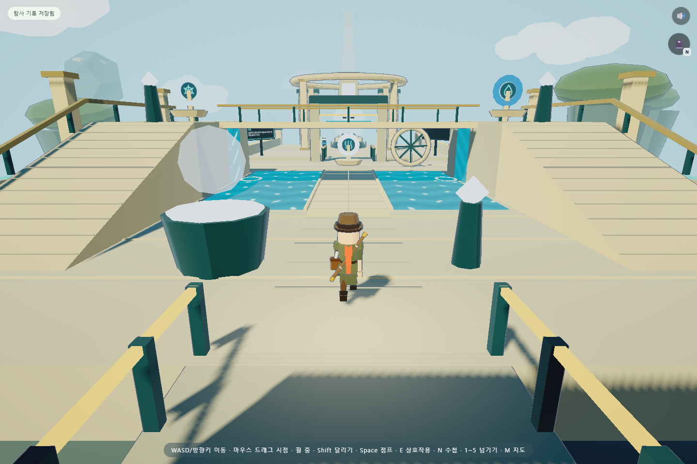

# 물 사당 입체 회랑 구현 보고서

2026-09-08 · 로컬 구현 완료 · 레퍼런스 01을 기준으로 한 첫 적용

물 사당의 세 번째 방을 **평평한 밸브 방에서 위아래를 탐험하는 회랑**으로 바꿨다. 두 경사로, 첫 밸브로 열리는 다리, 아래 돌길을 실제로 걸을 수 있다. 물 사당의 장치·힌트·안전한 위치를 저장해 재접속과 재입장 때 이어간다.

## 실제 게임 화면

세 밸브를 채운 뒤 입구 쪽으로 걸어 돌아와 찍은 화면이다. 생성 이미지가 아니라 로컬 게임의 브라우저 캡처다.

[첫 입장 화면](evidence/water-court/court-entry.png) · [위층 회랑](evidence/water-court/court-gallery.png) · [모바일](evidence/water-court/court-mobile.png) · [구현 전 레퍼런스](reference/water-court-v01.png)

## 달라진 플레이

| 항목 | 구현 |
|---|---|
| 세 번째 방 | 26×26u. 기존 10×12u에서 확대 |
| 양쪽 회랑 | 높이 3u, 경사로 수평 길이 8u. 보이는 경사와 보행 높이를 일치시킴 |
| 연결 다리 | 12×4u. 첫 밸브를 채우면 1.25초에 걸쳐 펼쳐지고, 전개 완료 후 위로 통행 |
| 아래 돌길 | 폭 2.8u. 다리가 열려도 아래로 통과 가능 |
| 온도 장치 | 아래와 양쪽 회랑의 손잡이가 같은 온도 상태를 조절. 세 밸브의 요구 상태는 섞임 |
| 조작 거리 | 높이를 포함해 가까운 대상을 선택. 아래에서 위층 밸브를 조작할 수 없음 |
| 카메라 | 다리 아래에서는 먼저 각도를 낮춤. 회랑 옆면은 실제 메시로 충돌 확인 |
| 완료 후 귀환 | 구슬을 얻으면 신전 옆 귀환 장치로 입구에 이동 |
| 돌아가는 길 | 완료한 얼리기 구간은 열린 얼음길, 미끄럼 구간은 구멍이 메워진 안정된 길로 유지 |

이 수치는 게임 좌표 단위다. 물 사당의 일반 관문 3개와 마지막 퍼즐 1개 구성은 유지한다. 기존 다섯 사당을 전부 입체 구조로 재제작한 것은 아니다.

## 이어하기

- 물 사당의 첫 입장 난이도, 얼음의 무작위 지속 시간과 현재 단계·시간, 미끄럼 구멍 배치를 저장한다.
- 온도, 밸브의 요구 상태와 채운 상태, 다리 전개 정도, 마지막 퍼즐의 맞힌 수·요구 상태, 구슬과 힌트를 복원한다.
- 높은 회랑과 열린 다리 위의 위치도 유지한다. 점프 중이면 해당 위치의 바닥에서, 녹는 얼음 위면 안전 발판에서, 미완료 미끄럼 구간이면 그 방 입구에서 이어간다.
- 나갔다 다시 들어가도 미완료 물 사당을 초기화하지 않는다. 다른 다섯 사당의 미완료 도전은 기존처럼 입구 밖에서 재시작한다.
- 물 사당 필드가 없는 이전 저장을 읽는다. 손상된 물 사당 데이터는 전체 검증을 마치기 전에 장치를 바꾸지 않는다. 전체 저장 복원 과정에서 손상을 발견하면 기존 백업 흐름으로 원본을 보관하고 읽을 수 있는 나머지 진행을 복원한다.

## 레퍼런스와 비교

| 기준 | 이번 적용 | 남은 차이 |
|---|---|---|
| 공간 구성 | 양쪽 높은 회랑·중앙 돌길·위 다리·둥근 신전 지붕 | 레퍼런스의 계단은 안정된 경사로와 줄눈으로 표현 |
| 색과 빛 | 밝고 따뜻한 석재, 청록색 물, 시원한 하늘과 그림자 | 이미지의 부드러운 간접광과 풍부한 재질 변화까지 같지는 않음 |
| 물 | 시간에 따라 흐르는 수면 무늬·폭포·포말·완료 후 물레 | 실제 유체·반사·굴절 시뮬레이션은 아님 |
| 장치 | 얼음·물·수증기 문양, 채움 표시, 공통 온도 손잡이 | 레퍼런스의 둥근 금속 계기판과 손잡이 형태는 더 다듬을 수 있음 |
| 자연 배경 | 외곽 화분과 낮은 식생, 먼 녹색 바위섬 | 울창한 숲과 산맥, 손으로 칠한 질감은 다음 미술 과제 |
| 수첩 | 기존 PC N 표시와 모바일 수첩 버튼을 유지하고 확인 | 레퍼런스의 책 그림으로 아이콘을 교체하지는 않았음 |

**판단:** 입체 공간과 장치 반응은 플레이에 반영했다. 시각적 완성도가 콘셉트 이미지와 같아졌다고 보기는 어렵다. 다음 미술 작업은 계기판 모델·석재 모서리와 재질·원경 식생을 같은 시점에서 비교하며 다듬는 것이 적절하다.

## 검증 결과

| 검사 | 결과 | 범위 |
|---|---|---|
| 새 물 사당 브라우저 검사 | 21개 통과 | 입구부터 실제 이동 입력으로 모든 물 퍼즐·구슬·귀환까지 진행. 좌우 시작 순서, 높은 난이도, 저장·예외·모바일 포함 |
| 기존 내장 A~W | 23개 그룹 모두 통과 | 물 사당에 들어간 상태에서 실행하고, 이후 현재 방·위치·진행이 유지되는지도 확인 |
| 기존 일반 통합 검사 | 26개 통과 | 시작·연구실·수첩·입력·일시정지·기존 저장·기본 사당 흐름 |
| 저장·엔딩 예외 | 15개 통과 | 이전 기록·백업 실패·손상·재개 대사·엔딩 유지 |
| 소스와 자원 | 80개 모듈·216개 상대 import·19개 vendor 해시 통과 | 문법·로컬 의존성·음악 경로 |
| 상태·음향·저장 도구 | 통과 | 기존 모듈 상태 8개, 음향 7개 시나리오와 저장 왕복·백업·예외 |

검사 수는 시나리오와 그룹 수이며 서로 겹치는 검증이 있다. 물 사당 완주 검사는 초기 연구실 진행과 사당 입장만 준비하고, 내부에서는 좌표 순간이동 없이 이동 입력과 E로 진행했다. 자동 조향을 사용하므로 어린이의 길 찾기 이해도나 실제 플레이 시간 측정과는 다르다. 모바일은 Edge의 터치 에뮬레이션이며 실물 기기 검증은 별도다.

검사가 잘못된 구현을 검출하는지도 확인했다. 이동 높이를 항상 0으로 만들면 회랑 높이 검증이 실패하고, 밸브 복원을 지우면 이어하기 검증 조건을 만족하지 못한다. 반복 배치 메시 사이의 허공과 실제 조각을 구분한 뒤 조각을 카메라 위치로 옮기면 점유가 검출된다.

## 측정과 수정 과정

- 같은 입구 시점에서 반복 장식을 묶기 전에는 그리기 호출 838회, 적용 후에는 681회였다. 약 **19% 감소**다. 전체 렌더 패스 합산이며 FPS나 모든 기기의 성능 보장이 아니다.
- 해당 물 사당 씬은 메시 505개다. 최종 캡처 프레임의 렌더 패스 합계는 18,863삼각형이었다. 같은 묶음 안의 조각을 함께 그리므로 호출 감소와 삼각형 감소가 항상 일치하지 않는다.
- 검사 중 현재 사당 참조가 다른 사당으로 바뀌어 남는 기존 문제가 드러났다. 자체 검사의 바깥에서 현재 방·장면·위치·상태를 보존하도록 수정했다.
- 처음 카메라 검사는 인스턴스 묶음 전체의 큰 경계를 물체로 보아 줄눈 사이의 허공도 막힌 것으로 오인했다. 실제 조각별 경계로 검사하도록 바로잡았으며 실물 점유 검증은 유지했다.
- 첫 자동 캡처에는 장면 전환 섬광과 시작 화면의 사라지는 애니메이션이 남았다. 게임 시뮬레이션 시간과 화면 애니메이션의 실제 시간이 다르기 때문이었다. 최종 캡처는 두 효과가 끝난 뒤 찍었다.

## 근거와 재현

- [새 검사 JSON](evidence/water-court/checks.json), [자체 검사 전체 로그](evidence/water-court/selftest.txt)
- [최적화 전 측정](evidence/water-court/before-batching.json)
- [일반 통합 검사](evidence/water-court/quality-check.json), [저장·엔딩 검사](evidence/water-court/endflow-check.json)
- [검사 실행 안내](../../tools/TESTING.md) — 저장소 루트의 `tools/TESTING.md` 참조
- [물 사당 검사 코드](../../tools/check-water-court.cjs) — 저장소 루트의 `tools/check-water-court.cjs` 참조

실제 파일 경로는 프로젝트 루트 기준 `src/shrine/WaterCourt.js`, `WaterProgress.js`, `WaterGates.js`, `RoomActor.js`, `Room.js`와 `src/data/waterCourt.js`, `lighting.js`에 나뉜다. 일반 앱 호출 경로에 생성형 이미지 API를 추가하지 않았다. 이번 변경은 로컬 작업이며 공개 서비스 배포는 수행하지 않았다.
