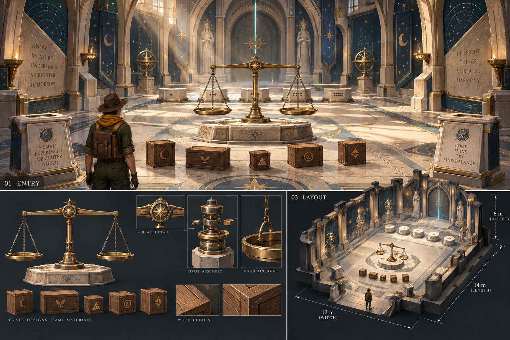

# 별의 천칭 회랑 — 상세 레퍼런스 01

2026-09-09 · 내장 ImageGen으로 생성한 **신규 디자인 시안**이다. 실제 게임 화면이나 완성된 Blender 모델이 아니다. 기존 퍼즐 분석은 [구성 보고서](PUZZLE_STRUCTURE_REPORT.md)에 정리했다.

## 세 시점의 역할

| 패널 | 제작 기준 |
|---|---|
| 01 ENTRY | 문틀 너머 중앙 천칭, 앞쪽 상자, 뒤쪽 받침, 마지막 출구가 차례로 보이는 입장 시점 |
| 02 BALANCE | 황동 축·가로대·사슬·접시·석재 기단의 부품과 재질 기준 |
| 03 LAYOUT | 좌우 우회 동선, 실험 구역과 답안 구역의 분리, 벽 모듈 배치 |

## 모델링에 가져갈 요소

- 상아빛 석재와 깊은 청록 벽면, 황동 테두리. 별지도 부조는 우주 범선과 신전의 세계관을 잇는다.
- 입구와 출구를 강조하는 높은 반복 아치. 화려한 부조는 가장자리와 높은 벽에 집중한다.
- 손으로 올릴 수 있는 높이의 양팔 저울. 중앙 축과 두 접시가 선명하게 구분되어야 한다.
- 같은 목재 계열의 다섯 실험 상자. 문양으로 구별하되 문양과 무게를 고정 연결하지 않는다.
- 다섯 개의 낮은 받침과 점 표식. 바닥 밝기는 장치의 가장자리와 이동 경로를 구별할 수 있게 유지한다.
- 입구 양쪽 안내대. 실제 목표·힌트는 한국어로 작성하며 필요한 상세 설명을 별도 읽기 화면에 제공한다.

## 이미지 그대로 만들지 않을 부분

생성 그림은 미술 기준이며 정확한 설계 도면은 아니다. 패널 간 거리·크기·부품 개수는 Blender 배치 데이터로 확정한다.

1. 벽과 안내대에 생성된 영문 문구는 채택하지 않는다. 실제 목표와 힌트로 교체한다.
2. 현재 높이는 5.5이며 그림의 8m는 제안값이다. 높이를 올리기 전에 카메라·기둥·그림자 범위와 비용을 확인한다.
3. 장치 기단의 단차는 접근을 막지 않아야 한다. 접시 앞은 평탄하게 만들고 큰 장식 계단은 보행 밖에 둔다.
4. 천칭 상세 패널의 분해도는 가동 축의 분위기를 보여 준다. 실제 회전은 가로대 중심의 수평 축이고, 접시는 반대 회전으로 수평을 유지하도록 리깅한다. 그림 속 세로 원통 분해도를 그대로 회전 구조로 사용하지 않는다.
5. 받침은 정확히 다섯 개, 점은 왼쪽부터 1·2·3·4·5개로 코드에서 만든다. 생성 이미지의 작은 점 개수에 의존하지 않는다.
6. 그림 속 인물의 사실적 비율과 재질을 그대로 게임 캐릭터에 적용하지 않는다. 현재 캐릭터를 넣은 실제 시점으로 크기와 대비를 다시 확인한다.
7. 그림의 조각상·불꽃·소품은 선택 장식이다. 장치와 동선 검증 후 성능 여유에 따라 적용한다.

## Blender 제작 순서

**A. 배치 확정:** 현재 12×14 바닥 안에 상자 다섯, 천칭 하나, 받침 다섯을 배치한다. 좌우 통로와 카메라 회전 공간을 검증한다.

**B. 건축 모듈:** 바닥·벽·기둥·아치·문틀을 반복 가능한 부품으로 만든다. 상아 석재·청록 홈·황동 장식의 세 층을 유지한다.

**C. 장치 모델:** `balance_pivot`, `balance_beam`, `pan_left`, `pan_right`를 분리하고 원점을 맞춘다. 실제 게임의 판정 좌표와 시각적 접시 위치가 일치하도록 연결한다.

**D. 표식과 외관:** 상자 문양, 받침 점, 한국어 안내는 정확한 데이터로 제작한다. 모든 상자 상태가 저장 후 같은 외관과 위치로 돌아와야 한다.

**E. 조명과 마감:** 따뜻한 상부 빛, 청록빛 장치, 얇은 먼지를 더한다. 텍스트 번짐과 모바일 대비를 확인한다. 처음부터 최종 시안 수준의 고비용 효과를 전부 넣지 않는다.

제작 목표: 모델 삼각형 8만 개·재질 12개 이내를 출발점으로 삼고 실제 프레임 비용으로 조정한다. 레퍼런스 수준의 완성도를 바로 보장하는 수치는 아니다.

## 산출물

- 이미지: [balance-court-v01.png](reference/balance-court-v01.png)
- 최종 생성 프롬프트: [balance-court-v01-prompt.txt](reference/balance-court-v01-prompt.txt)
- 생성 방식: 내장 ImageGen, 새 이미지 생성. 세 시점을 한 장에 배치해 일관성을 검토했다.
- 이번에는 원본 게임·퍼즐·Blender 모델을 수정하거나 배포하지 않았다. 이 시안을 바탕으로 다음 단계에서 단순 공간 모델을 만든다.
