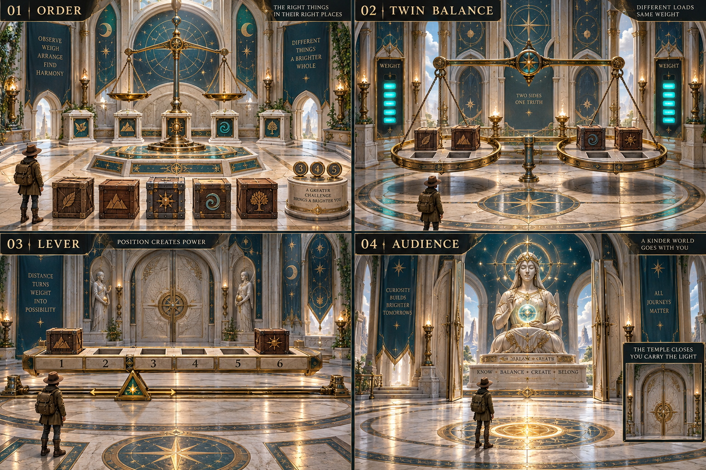
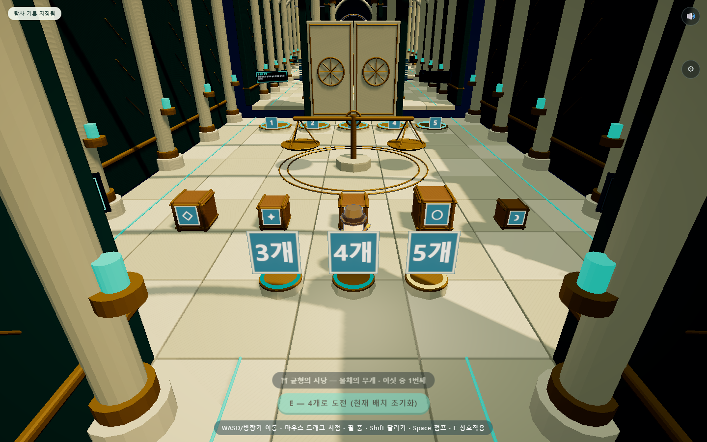
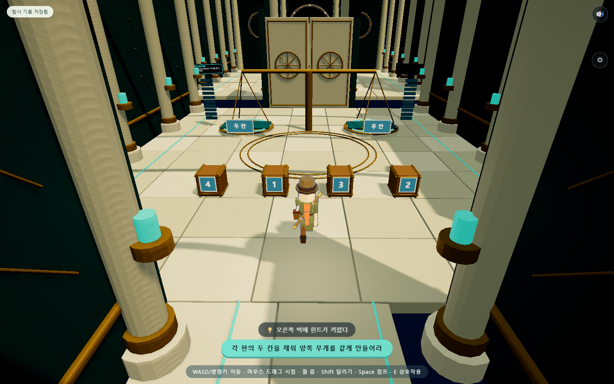
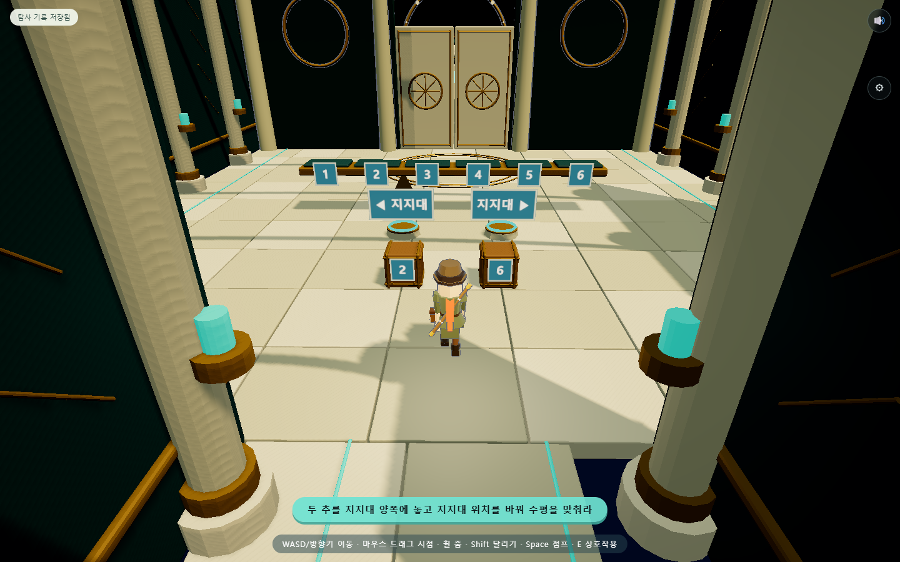
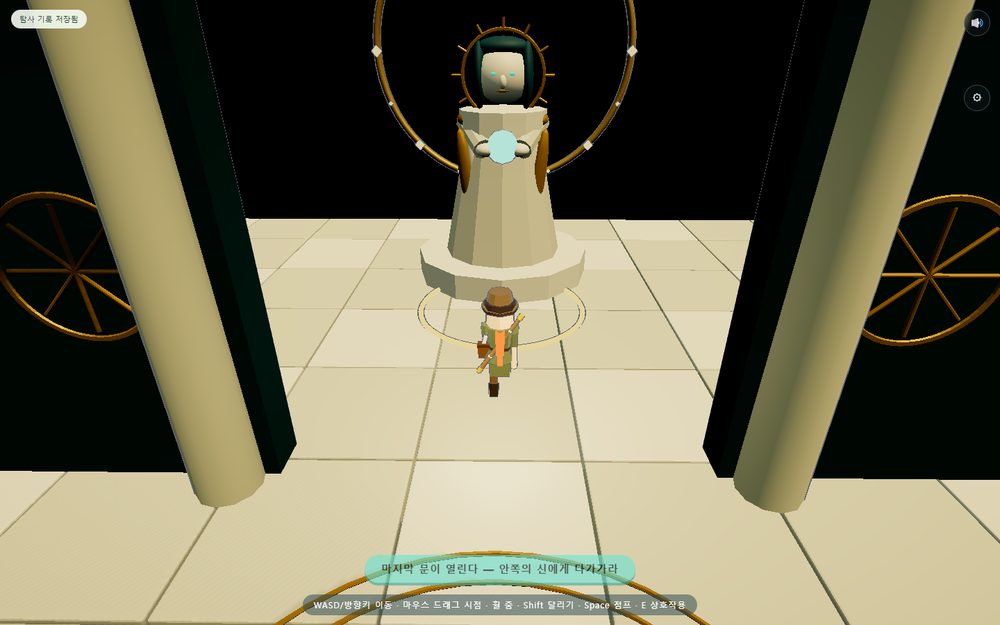

# 균형의 사당 전체 개편 — 새 퍼즐과 Blender 모델

2026-09-09 · 로컬 적용. 사용자가 지정한 세 단계 규칙으로 변경하고, 마지막 문 뒤에서 신을 만나 자동 퇴장한 뒤 사당이 밀봉되는 흐름까지 연결했다.

## 먼저 만든 전체 시안

내장 ImageGen으로 제작한 디자인 시안이다. [생성 프롬프트](reference/balance-temple-v02-prompt.txt)를 보관했다. 시안의 영문 문구·고정 상자 문양은 게임 규칙으로 쓰지 않는다. 실제 모델은 현재 캐릭터에 맞는 단순화된 입체 표현이며 시안의 정교한 조각·재질과 동일한 완성도를 뜻하지 않는다.

## 적용된 규칙

| 구간 | 조작과 성공 조건 |
|---|---|
| 무게의 회랑 | 입구의 3·4·5개 표식에서 E로 난이도 선택. 두 접시에 상자를 올려 비교하고 왼쪽부터 가벼운 순서로 모두 배치하면 문 개방 |
| 두 판의 균형 | 네 상자를 양쪽 판의 두 칸씩에 배치. 무게에 따라 옆의 빛 칸이 차고, 두 칸씩 모두 채운 상태에서 양쪽 합이 같으면 문 개방 |
| 여섯 칸의 지레 | 전체 여섯 칸에 2와 6의 추를 놓고, 지지대를 다섯 칸 사이 위치 중 하나로 이동. 양쪽에 추가 있고 무게×지지대까지의 거리 합이 같으면 마지막 문 개방 |
| 알현실 | 신에게 다가가면 축복 대사 시작. 약 4.5초마다 자동 진행하며 클릭·E로 넘기거나 Esc로 생략 가능. 완료 후 지혜 기록, 자동 퇴장, 외부 봉인 표시와 재입장 차단 |

첫 방의 난이도를 다시 선택하면 그 방의 현재 배치가 초기화된다. 완료 후에는 선택을 잠근다. 크기와 문양은 무게 순서와 고정 연결하지 않으며 3·4·5개 각각에서 크기만으로 정렬되지 않도록 생성한다. ‘내려놓기’는 원래 자리 반환이라고 명확히 안내한다.

두 번째 방에는 기존 숫자 목표와 세 라운드가 없다. 1·2·3·4 상자로 1+4와 2+3처럼 같은 무게를 만들 수 있다. 각 판에는 두 칸만 있으므로 한쪽에 세 개를 올려 통과할 수 없다.

마지막 지레는 고정된 중앙 지지점에서 양쪽 세 칸인 옛 문제와 다르다. 예를 들어 지지대가 2·3번 칸 사이에 있을 때 2의 추를 1번, 6의 추를 3번에 놓으면 거리 1.5와 0.5에 따라 3=3이 된다. 빈 막대는 성공이 아니다. 지지대의 다섯 위치 각각에 해법이 있는지 전수 검사했다.

## 실제 게임 화면

[모바일 화면](evidence/balance-temple/mobile.png)

Blender에서 건축 모듈·기둥·반복 아치·별 문양·상자·천칭·문·지레·신의 석상을 만들었다. 석재·황동·청록 장식과 상부 조명을 사용했다. [편집용 원본](../../art/balance-temple/balance-temple-v02.blend)과 [재생성 방법](../../art/balance-temple/README.md)을 남겼다.

## 저장과 이전 기록

- 선택한 개수, 든 상자, 접시·받침·판·지레 칸, 지지대 위치, 완료 상태를 저장한다.
- 중복 점유, 잘못된 지지대 위치, 정답 상태와 맞지 않는 완료 기록은 적용 전에 거부한다.
- 이전 균형 사당 기록은 완료한 단계를 보존하고 입구에서 재개한다. 규칙이 달라진 미완료 단계의 배치는 새 문제로 초기화한다. 다른 사당 기록은 이 변환의 대상이 아니다.
- 알현 중 저장 후 재접속하면 완료 전 이벤트를 다시 진행할 수 있다. 축복 완료 후에는 기록된 완료 상태를 바탕으로 재입장을 막는다.
- 기존 완료 기록에도 밀봉 규칙을 적용한다. 다시 플레이하려면 기존 기록과 별도로 새 탐사를 시작해야 한다.

항해대 숫자는 손잡이 위의 별도 고정 숫자창으로 올려 상판·손잡이의 가림도 개선했다.

## 검증

| 검사 | 결과 |
|---|---|
| 새 사당 전체 흐름 | 8개 통과: 실제 보행·세 퍼즐·마지막 문·자동 이벤트·퇴장·밀봉·저장·오류 검사 |
| 추가 난이도·모바일·저장 | 6개 통과: 3·4개 풀이, 모든 지지점 해법, 터치 선택·집기, 재접속, 이전 기록 변환 |
| 기존 범선 검사 | 12개 및 내부 A~X 공통 검사 통과 |
| 기존 상태 왕복 | 8개 통과 |
| 소스 및 저장 검사 | 로컬 의존성·vendor 해시, 저장 실패·백업·잘못된 데이터 검사 통과 |

[전체 흐름 검사](evidence/balance-temple/report.json) · [모바일·저장 검사](evidence/balance-temple/mobile-save.json)

공통 검사에서 새 알현실을 일반 퍼즐 방으로 오인하던 조건과 문기둥 카메라 겹침을 수정했다. 기존 무게 방 전용 검사도 새 3·4·5개 계약에 맞게 바꿨다. 자동 검사는 정답을 알고 조작하며, 실제 저사양 휴대폰의 장시간 성능과 신규 사용자의 자력 해결 검증은 별도다.

이번 결과는 실제 조작 가능한 첫 통합판이다. 시안의 고밀도 조각, 표면 질감, 복잡한 광원 효과는 현재 모델에서 단순화했다. GitHub 푸시와 공개 배포는 이번 작업에서 실행하지 않았다.
