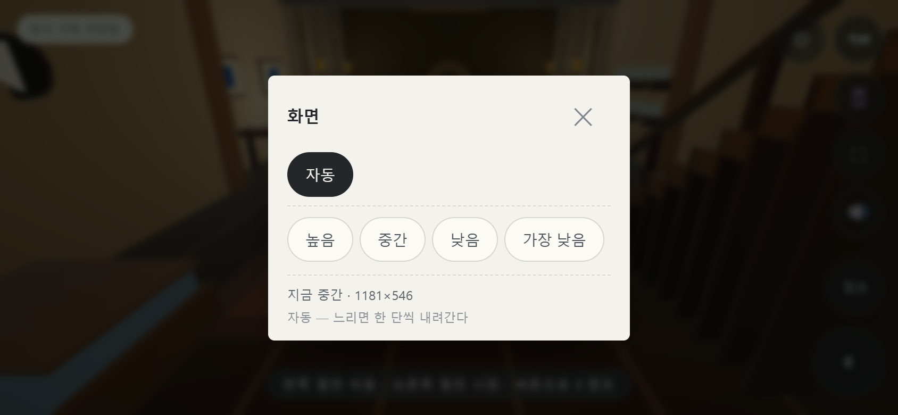

# GitHub 최신 변경 통합

2026-09-09 기준 원격 `aed856d`를 `.integration/upstream`에 클론하고, 추가된 세 커밋을 기존 로컬 개편과 통합했다. 실제 수정·실행 대상은 계속 `D:/mumumetro`다. 통합 전 해당 파일은 `.integration/before`에 보존했다. 클론과 백업은 `.gitignore`에서 제외했다.

작업 트리의 코드 통합이며 Git 병합 커밋을 만들지는 않았다. 루트 저장소 HEAD는 `be9b7b4`로 유지된다. GitHub 푸시와 공개 배포는 수행하지 않았다.

## 적용 결과

- **압력판 상자 반환:** 들고 있을 때 다른 재고 상자가 선택을 가로채지 않는다. 빈 곳에서 E를 누르면 원래 자리로 돌아간다.
- **연구소 끼임 방지:** 다이얼과 계단의 여러 원형 충돌을 캡슐 형태로 연결했다. 카메라 검사도 선분까지의 거리를 사용한다.
- **화질 설정:** 자동 및 네 화질 단계, 수동 선택 저장, 느린 프레임이 지속될 때 자동 하향 조절을 추가했다. 캔버스와 후처리 버퍼를 같은 실제 픽셀 크기로 맞춘다.
- **조명:** 원격 변경에서 행성 태양에 적용하던 해상도 조절을 사당 태양에도 연결했다. 입장 시와 화질 전환 시 모두 적용된다.
- **버튼 배치:** PC 설정 버튼을 수첩 아래 122px에 배치했다. 낮은 가로 화면에서는 지도 왼쪽으로 이동해 조작 버튼과 겹치지 않는다. Enter·터치로 열고 Escape로 닫는다.
- **그림자 관문:** 회전 속도를 0.42에서 0.12로, 기본 노출 여유를 0.75초에서 1.8초로 변경했다. 진행 순서에 따른 추가 가속을 없앴다. 로컬의 입체 기둥 투영·완료 상태·이전 저장 복원은 유지했다. 원격의 고정 폭 그림자 띠는 기존 방식의 대체 경로에만 적용된다.
- **검사 상태 복원:** A~X 검사가 화질·지도·요리 상태를 남기지 않도록 보완했고, 저장 방향의 부동소수점 변화도 제거했다.

## 검증

| 검사 | 통과 항목 |
| --- | ---: |
| 통합: 화질·버퍼·자동 조절·조명·버튼·A~X 및 저장 보존·고장 주입 | 16 |
| 기존 전체 흐름: 연구소 보행·수첩·저장·복원·엔딩·모바일 | 26 |
| 입체 그림자: 시각과 판정·세 단계 실제 보행·저장·카메라·모바일 | 16 |
| 마지막 분리 신전: 도구 조작·이전 저장·보상·카메라·모바일 | 14 |
| 상태 저장: 연구소·채집·요리·지도 | 8 |
| **합계** | **80** |

통합 검사에 포함된 A~X 24개 그룹도 모두 실행·통과했다. 소스 111개 모듈, 로컬 import 283개, vendor 해시 19개 검사도 통과했다. 브라우저 검사는 외부 호스트를 차단한 Edge 자동화 환경에서 실행했다.

1280×800, DPR 2에서 캔버스는 높음 2560×1600, 중간 1792×1120, 낮음 1280×800, 가장 낮음 1024×640이었다. 각 단계의 후처리 버퍼도 같은 크기다. 이는 버퍼 크기 측정이며 실기기 FPS 향상률 측정은 아니다.

- [통합 결과](evidence/github-integration/report.json)
- [A~X 로그](evidence/github-integration/selftest.txt)
- [전체 흐름](evidence/github-integration/quality-check.json)
- [그림자 관문](evidence/github-integration/shade-court.json)
- [마지막 분리 신전](evidence/github-integration/sift-sanctum.json)
- [상태 저장](evidence/github-integration/state-roundtrip.json)

## 검토 중 잡은 문제와 다음 단계

첫 그림자 회귀 검사는 옛 실패 시간인 약 1.4초만 기다려 실패했다. 새 노출 여유를 기준으로 충분히 기다리도록 검사를 수정한 뒤, 경고와 안전 구역 복귀를 확인했다. 통합 검사에서는 기존 전체 검사가 지도와 요리 기록을 바꾸던 문제도 발견해 복원하도록 수정했다. 첫 화면 캡처는 검사에서 멈춘 애니메이션 때문에 전환 섬광이 남아 있었다. 프레임 재개 후 전환 종료를 기다려 다시 캡처했다.

다음에는 실제 태블릿에서 자동 화질과 그림자 관문의 체감 난이도를 확인하고, 계획했던 도구 사용 애니메이션과 처음 하는 사람의 연속 플레이를 진행한다. 이번 변경은 새 공간 제작이 아닌 기능 통합이며, 기존 시각 레퍼런스와 입체 공간을 유지했다.
