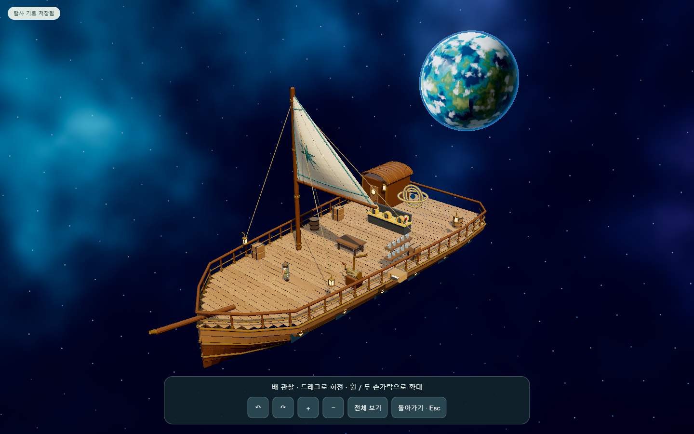

# 배 관찰 모드

범선 갑판에서 왼쪽 위 **⛵ 배 관찰** 버튼으로 연다. 대사·수첩 등 전면 화면이 열려 있으면 버튼을 숨긴다. 관찰 중에는 게임 진행을 멈추고, 닫을 때 진입 전 카메라 위치·방향·화각을 복원한다. 플레이어 위치와 저장 데이터는 변경하지 않는다.

- 마우스·한 손가락 드래그: 회전과 높이 조절
- 마우스 휠·두 손가락 간격·＋/− 버튼: 확대와 축소
- 방향키: 회전과 높이 조절
- 전체 보기: 기본 외관 시점
- 돌아가기·Esc: 플레이 복귀

모바일 세로 화면에서는 화면 비율에 맞춰 관찰 거리를 늘린다. 키보드 Tab 초점은 관찰 버튼들 안에서 순환한다.

[모바일 화면](evidence/ship-view/mobile.png)

`tools/check-ship-view.cjs`로 PC 1440×900과 모바일 390×844에서 열기·버튼 회전·확대·전체 보기·게임 진행 정지·복귀 후 저장 상태 일치·브라우저 오류 없음을 확인했다. 소스 검사도 통과했다. 실제 기기의 두 손가락 제스처 검증은 별도다.
