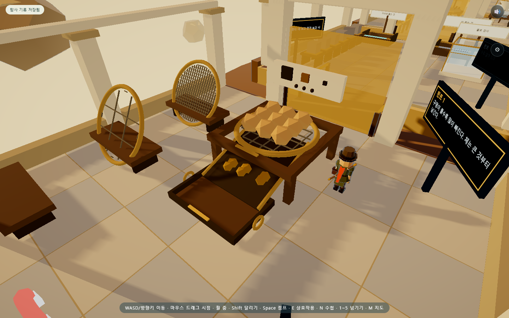

# 첫 체질 작업장 — 동작 연출

기존 황동 체·목재 작업대에 **1.4초 체질 연출**을 로컬 적용했다. 체가 좌우로 흔들리고 작은 알갱이가 망의 빈 구멍을 지나 경사받이와 아래 접시로 이동한다. 큰 알갱이는 체 위에 남는다.

## 시안과 실제 결과

기존 [분리 사당 레퍼런스](../2026-09-08/SIFT_REFERENCE.md)의 ‘위에 남은 것과 아래로 빠진 것을 함께 보여 준다’는 기준을 사용했다. 구현 전에 [세 단계 동작 시안](reference/sieve-motion-v01.svg)을 만들었다. 시안은 코드로 그린 동작 설명이며 게임 캡처가 아니다.

- [실제 동작 영상](evidence/sieve-motion/sieve-motion.webm)
- [재생 화면](evidence/sieve-motion/preview.html)

영상과 위 캡처는 과정을 확인하기 위해 카메라를 고정한 실제 렌더링이다. 게임 카메라를 이 시점으로 강제로 옮기지는 않는다. 영상은 프레임별로 게임 시간을 진행하며 기록하므로 실기기 FPS 측정 자료가 아니다.

## 구현 범위

- 체의 흔들림은 최대 0.035u이며 0.65초 동안 감쇠한다. 알갱이마다 약간의 시차를 두고 내려온다.
- 낙하 전 실제 망의 구멍 중앙으로 이동한다. 체와 알갱이 크기는 기존 mm 판정의 축척을 사용한다.
- 아래 접시에 모이는 위치를 조금 앞으로 옮겨 경사받이 끝에 재료가 가려지는 문제를 줄였다.
- 결과 판정은 기존처럼 조작 즉시 처리한다. 연출 때문에 다음 조작이나 이동을 기다리게 하지 않는다. 다음 상호작용은 남은 연출을 정리한다.
- 기존 도형·재질을 공유하는 표시용 객체를 사용한다. 연출 시간은 저장하지 않으며, 도중 저장을 복원하면 확정된 결과만 표시한다.
- 수첩 등 전면 창이 열리면 게임과 함께 멈춘다. 운영체제의 동작 줄이기 설정에서는 연출을 생략한다.

## 검증

| 묶음 | 결과 |
| --- | --- |
| 동작 전용 | 11개 통과: 크기별 분리, 실제 망 통과, 프레임 간격 독립성, 부분 혼합물, 수첩 정지, 중간 저장, 조작 중단, 재시작, 동작 줄이기, 고장 주입, 브라우저 오류 |
| 체질 기존 회귀 | 15개 통과: 이전 저장, 21개 조합 표시, 두 단계 체질 실제 보행, 반환, 모바일 E, 카메라 144시점 등 |
| 통합 회귀 | 16개 통과: A~X 전체 실행·저장 보존, 화질, 버튼 배치 등 |
| 합계 | **42개 통과** |

소스 112개 모듈·로컬 import 286개·vendor 해시 19개 검사도 통과했다. 영상은 브라우저에서 크기와 실제 재생을 확인했다.

- [동작 검사](evidence/sieve-motion/report.json)
- [체질 회귀 검사](evidence/sieve-motion/sieve-regression.json)
- [통합 회귀 검사](evidence/sieve-motion/integration-regression.json)
- [A~X 로그](evidence/sieve-motion/selftest.txt)
- [영상 재생 검사](evidence/sieve-motion/video-check.json)

## 비판적 검토와 후속 작업

초기 검사는 수첩을 소유하지 않은 저장을 사용해 수첩 버튼이 나타나지 않았다. 정지 검사의 준비 상태에 수첩 소유권을 명시해 바로잡았다. 화면 검토에서는 경사받이 뒤쪽으로 알갱이가 가려질 수 있어 받침 위치를 조정했다.

현재는 알갱이끼리 부딪히는 물리 시뮬레이션이나 인물의 손동작이 아니라 분리 과정을 설명하는 짧은 연출이다. 작은 모래는 먼 게임 시점에서 눈에 덜 띄며, 비슷한 구멍으로 모이는 알갱이가 일부 겹쳐 보일 수 있다. 입자 수를 무작정 늘리기보다 실제 태블릿에서 가독성을 확인하고, 다음에는 자석에 쇠가루가 붙는 동작을 같은 원칙으로 확장한다.

GitHub 푸시·공개 배포는 하지 않았다.
