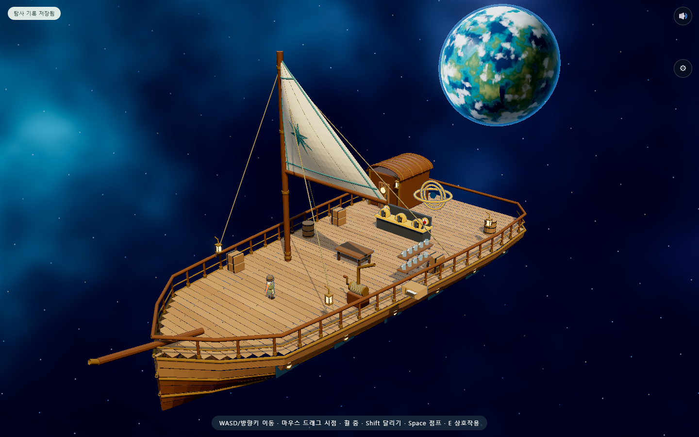
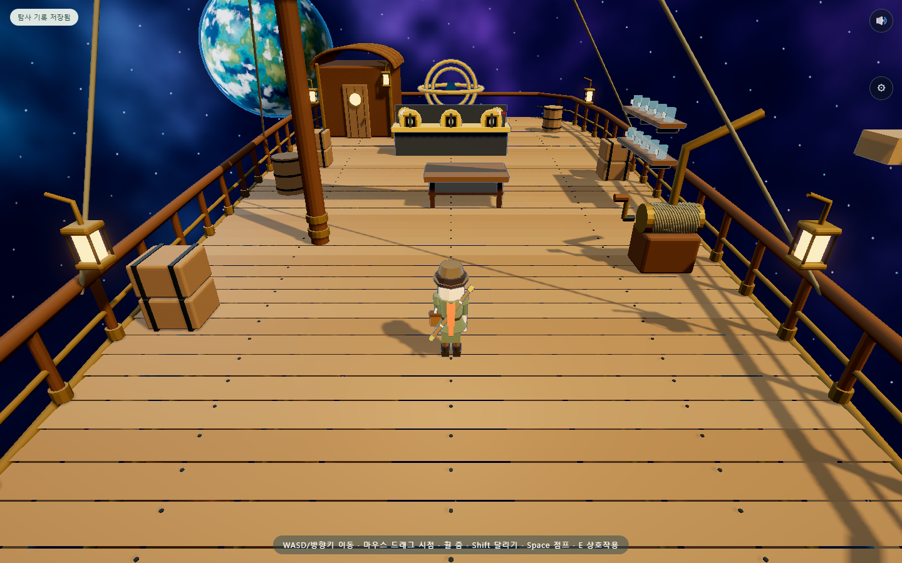

# 우주 범선 — Blender 모델과 도입부 1차 적용

2026-09-09 · 로컬 게임에 적용. 우주 범선 갑판에서 시작해 소포를 회수하고, 수첩을 얻고, 항해 고리를 맞춰 무무 행성으로 출발한다. 행성에서 돌아오면 같은 갑판으로 복귀한다.

후속 미술 개선: 범선에서 보는 우주를 구면 성운 배경과 색이 다른 별 2,600개로 바꿨다. 먼 행성에는 바다·해안·대륙·극지방·천천히 이동하는 구름과 푸른 대기층을 구현했다. 성운은 시작 시 한 번 생성하고 이후 텍스처로 그린다. 실제 착륙 행성의 지형은 이번 수정 범위에 포함하지 않았다. 아래 화면과 범선 검사 기록은 이 개선 후 다시 촬영·실행한 결과다. 범선 검사 12개와 A~X, 소스 115개 모듈·293개 로컬 import·vendor 해시 19개가 통과했다. 기존 26개·8개 결과는 최초 범선 적용 시 기록이다.

## 실제 화면

외관 검토용 카메라로 촬영한 실제 게임 모델이다. 아래는 평소 사용하는 3인칭 시작 화면이다.

## 범선 디테일과 원본

Blender를 실제 실행해 곡면 선체와 여섯 줄 외판, 갑판 널과 체결 핀, 곡선 난간과 황동 받침을 만들었다. 배부른 삼각 돛에는 테두리·솔기·나침반 문양을 넣고, 돛대·활대·밧줄·선수 돌출대를 구성했다. 선실에는 둥근 창과 문손잡이, 지붕 황동 띠를 더했다. 선체의 남색 패널과 둥근 창, 등불, 회수 윈치, 가장자리 상자와 통도 포함한다.

- [편집 가능한 Blender 원본](../../art/starsail/starsail-v01.blend)
- [게임용 GLB](../../assets/models/starsail-v01.glb)
- [재생성 방법과 좌표 기준](../../art/starsail/README.md)

GLB는 **14개 메시 · 14개 재질 · 삼각형 30,480개 · 1,416,256바이트**다. Blender 원본은 개별 부품을 유지하고 게임용 출력만 재질별로 합쳤다. 외부 텍스처 없이 재질 색과 형태로 표현한다.

## 플레이 흐름과 저장

1. 갑판에서 시작하고 오른쪽 윈치로 걷는다.
2. E 또는 모바일 조작 버튼으로 떠도는 소포를 건져 올린다. 밧줄과 회수망을 따라 1.5초 동안 작업대로 이동한다.
3. 작업대에서 소포를 열어 수첩을 얻는다. 수첩 아이콘으로 다시 읽을 수 있다.
4. 기존 항해 퍼즐의 세 숫자 고리를 맞춰 출항한다. 기존 정답과 행성 진행을 유지한다.
5. 귀환하면 갑판에 돌아온다. 도입·귀환·엔딩 문구를 여행자와 다음 항로라는 설정에 맞췄다.

내부의 기존 `lab` 구역과 저장 계약을 유지해 사당·채집 진행과 연결했다. 새 저장에 `parcelRecovered`를 추가하고 회수 시작 시 저장한다. 회수 도중 종료해도 재접속하면 작업대에 안정적으로 놓인다. 이전 저장에서 이 필드가 없으면 이미 회수한 소포로 처리한다. 수첩은 있는데 소포 미회수인 모순된 저장은 적용 전에 거부한다.

## 검증 결과

| 검사 | 결과 |
|---|---|
| 범선 전용 브라우저 검사 | 12/12 통과 |
| 기존 화질·UI·진행 검사 | 26/26 통과 |
| 상태 왕복 검사 | 8/8 통과 |
| 소스·로컬 의존성 검사 | 114개 모듈, 291개 로컬 import, vendor 해시 19개 통과 |
| 저장 검사 | 왕복·백업·잘못된 데이터·저장 실패 처리 통과 |

이름이 붙은 검사 총 46개를 통과했다. 범선 검사에는 A~X 공통 검증, 실제 보행을 통한 회수·수첩·출항, 귀환, 이전 저장과 잘못된 저장, 회수 중 저장 복원, 모바일 E·수첩 정지, 화질별 렌더링이 포함된다. 항해 정답은 자동 검사 코드가 알고 조작한다. 신규 사용자의 자력 해결 검증은 별도다.

[범선 검사 기록](evidence/starsail/report.json) · [A~X 기록](evidence/starsail/selftest.txt) · [기존 검사 기록](evidence/starsail/quality-check.json) · [상태 왕복 기록](evidence/starsail/state-roundtrip.json) · [모바일 화면](evidence/starsail/mobile.png)

1440×900, DPR 1에서 후처리를 포함한 프레임 전체 측정값은 다음과 같다. 모델 자체의 메시 수와 프레임 전체 그리기 호출 수는 다르다.

| 화질 | 그리기 호출 | 삼각형 | 출력 크기 |
|---|---:|---:|---|
| 높음 / 중간 | 360 | 67,651 | 1440×900 |
| 낮음 | 347 | 67,638 | 1440×900 |
| 가장 낮음 | 137 | 33,202 | 1152×720 |

이는 FPS나 저사양 실기기의 성능 보장이 아니다.

## 확인하면서 고친 부분

- 실내 카메라 제한 때문에 바닥을 내려다보던 시작 시점을 열린 갑판에 맞게 조정했다.
- 합쳐진 모델의 큰 경계 상자가 빈 갑판을 막는 오판을 연결된 부품 단위 검사로 고쳤다. 분리된 면 정점도 같은 좌표끼리 묶는다. 선실 내부는 고체이고 열린 갑판은 고체가 아닌지 검사한다.
- 회수 후에도 윈치 위치 식별이 유지되도록 고쳤다. 표본 선반과 채워진 병의 기존 진행 표시도 유지했다.

## 다음 미술 작업

이번 결과는 **플레이 가능한 1차 모델**이다. 레퍼런스 수준의 최종 그래픽은 아직 아니다. 현재 갑판은 넓고 평평하며, 선실은 외관만 구현했다. 돛과 밧줄은 고정되어 있고 자유 비행 조종은 없다.

다음 순서는 선체 깊이와 갑판 단차·비례 조정, 목재 표면과 금속 재질 보강, 성운과 항로 배경, 돛의 미세한 움직임이다. 출항과 엔딩은 기존 전환·대사 흐름을 사용하며 배가 이동하거나 다음 소포를 내보내는 전용 장면은 후속 작업이다. 레퍼런스와 실제 보행 화면을 함께 비교하며 개선한다.

GitHub 푸시와 공개 배포는 하지 않았다.
