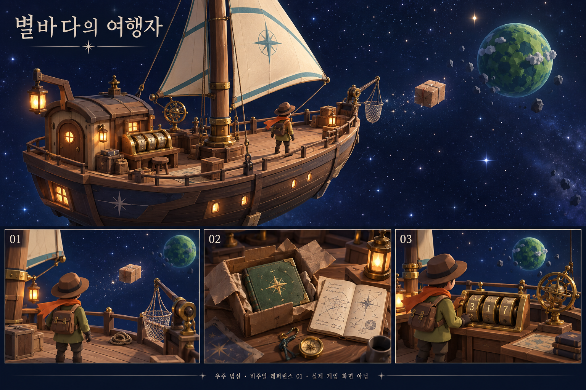

# 별바다의 여행자 — 우주 범선 도입부

2026-09-09 · 레퍼런스와 구현 시나리오 01 · **기획안이며 게임 적용 전**

## 핵심 제안

주인공은 이미 우주를 여행하는 작은 범선의 여행자다. 항해 중 발견한 소포를 건져 올리고, 그 안의 수첩에 남은 좌표를 풀어 무무 행성으로 향한다. 수첩은 여행을 시작하게 하는 설명서이자, 자기 발견을 쌓아 가는 기록이 된다.

첫 버전의 조작 범위는 **범선 갑판 걷기·소포 회수·수첩 읽기·항해 장치 조작·행성으로 이동**이다. 우주 전체를 자유롭게 비행하는 기능은 별도 확장으로 둔다. 배 주변 별과 먼 행성은 원경이고, 지금 갈 수 있는 공간은 갑판임을 난간과 시점으로 분명하게 한다.

## 1. 레퍼런스

상단은 선체·돛·별바다·발견한 소포의 관계, 하단은 회수 장치·수첩 발견·항해 장치의 세 장면을 목표로 삼았다. 이미지의 세부 구조와 최종 구현은 구분한다. [이미지 프롬프트](reference/starsail-v01-prompt.txt)와 실제 이미지 검토 내용은 [별도 검토 문서](STARSAIL_REFERENCE.md)에 보관한다.

### 미술 기준

- 작은 목재 선체, 황동 장치, 크림색 태양 돛, 따뜻한 등불과 남색 별바다. 낡았지만 잘 관리된 여행자의 배.
- 갈색 모자·올리브색 옷·주황 목도리의 기존 여행자를 유지한다. 갑자기 우주복이나 다른 주인공으로 바꾸지 않는다.
- 주 이동선은 밝게 읽히는 목재 갑판으로 만든다. 낮은 난간 너머로 소포와 목적지 행성이 보인다.
- 체험할 장치는 회수 손잡이, 소포 작업대, 숫자 고리 세 개가 있는 항해대다. 새 버튼 메뉴 대신 걸어가서 E로 조작한다.
- 배는 거의 고정하고 돛과 별만 아주 천천히 움직인다. 카메라·충돌 바닥을 흔드는 연출은 첫 버전에서 제외한다.
- 광원은 주광과 약한 보조광을 중심으로 구성한다. 별마다 광원을 만들지 않는다. 실제 천·밧줄 물리 대신 제한된 도형과 짧은 연출을 쓴다.

## 2. 처음 5~8분의 목표 흐름

시간은 플레이 목표이며 측정값이 아니다. 대사와 수첩은 사용자가 넘기며, 시간제한은 없다.

| 장면 | 보이는 것 | 플레이어 행동과 프롬프트 | 완료 조건 |
| --- | --- | --- | --- |
| 01 항해 중 | 열린 갑판, 돛, 가까이 떠 있는 소포 | 선수 쪽 갑판에서 중앙으로 걷는다. 짧은 혼잣말 뒤 시점과 이동을 자유롭게 쓴다. | 회수 장치 근처에 접근 |
| 02 발견과 회수 | 우현 바깥의 소포, 같은 위치를 향한 회수망 | `E — 소포 건져 올리기`. 망이 소포를 갑판 받침으로 옮기는 짧은 연출 | 소포가 갑판에 확보됨. 놓치거나 재료를 잃지 않음 |
| 03 소포 열기 | 묶인 상자와 희미한 수첩 표지 | 소포 작업대에 다가가 `E — 소포 열기` | 수첩 획득. PC·터치 수첩 버튼 활성화 |
| 04 직접 읽기 | 여섯 물음, 답이 없는 페이지, 번진 마지막 좌표 | N 또는 수첩 버튼으로 편다. 편지 면에서 숫자 두 개와 세 번째의 단서를 읽는다. | 기존 읽음 진행 조건을 충족 |
| 05 항로 맞추기 | 숫자 고리 세 개, 항로가 아직 끊긴 성도 | 각 고리 앞에서 `E — 첫째/둘째/셋째 고리 돌리기`. 수첩의 두 숫자와 합 단서를 적용 | 세 숫자가 모두 맞음. 고리가 정렬되고 항로가 연결됨 |
| 06 출발 | 항해대 옆 출항 손잡이, 정면의 행성 | 별도 위치에서 `E — 무무 행성으로 출발` | 목적지 확정·저장 후 전환 |
| 07 첫 착륙 | 기존 행성 내림판과 모닥불 | 발이 지면에 닿은 뒤 기존 탐험으로 이어짐 | 행성 이동·수첩·채집·사당 기능 사용 가능 |

소포 회수는 발견을 손으로 확인하는 행동이다. 별도의 반응속도 시험이나 실패 퍼즐로 늘리지 않는다. **도입부의 생각할 문제는 수첩을 읽고 항로를 맞추는 기존 세 자리 장치**가 맡는다.

출항 손잡이는 숫자 고리와 분리한다. 마지막 숫자를 맞추는 순간 플레이어 의사와 무관하게 장면이 바뀌지 않게 한다. 틀린 숫자에는 벌이나 큰 실패음을 주지 않고, 항로가 아직 연결되지 않은 상태로 남긴다.

## 3. 공간과 동선

배 전체 모습보다 먼저 실제 보행 공간을 만든다. 1차 구현에서는 현재 `Lab.js`의 세 구역 좌표와 `LAB_ENTRY_Z = 7` 계약을 활용해 기존 이동 로직과의 차이를 줄인다.

| 기존 영역 | 범선에서의 역할 | 첫 구현 방향 |
| --- | --- | --- |
| `rest`, z 2.5~10.5 | 선수 관찰갑판·시작 위치 | 침상 중심 도입을 없애고 열린 갑판에서 시작. 소포를 먼저 볼 수 있게 시점 배치 |
| `work`, z -3.5~2.5 | 중앙 갑판·소포 작업대 | 우현 회수 장치와 작업대를 배치. 소포는 바깥→받침의 짧은 경로로 이동 |
| `send`, z -12.5~-3.5 | 선미 항해대·작은 선실·출항 장치 | 기존 세 다이얼은 황동 항해 고리로, 이동 판정은 출항 손잡이로 표현. 빈 병은 선실 옆 탐사 표본 선반으로 사용 |

선체 외곽은 보행 영역을 감싸도록 만들되 삼각형 선수 끝까지 걸을 수 있다고 오해하게 만들지 않는다. 중심 통로의 사용 가능한 폭은 **최소 2.4u를 목표**로 하고 실제 캐릭터·상호작용 거리로 검증한다. 돛대는 통로 옆에 두고 돛과 밧줄은 카메라 시야를 가리지 않도록 높인다. 장식 난간과 실제 보행 경계도 일치시킨다.

첫 회수 경로는 밧줄 물리 계산 없이 고정 경로를 따라 움직인다. 플레이어가 위치를 옮기거나 수첩을 열 때 잘못된 상태가 남지 않게 한다. 망을 조준하는 별도 조작은 필요하지 않다.

## 4. 대사 초안

주인공은 이름 없는 혼잣말, 지킴이는 기존 해라체를 유지한다. 다음 문장은 제안이며 소스의 실제 대사를 아직 교체하지 않았다.

**항해 중**

> 같은 별을 한참 따라왔다. 오늘은 다른 길로 가 볼까.
> …저건 상자잖아. 배 옆으로 떠오고 있다.

**회수 후**

> 소포였다. 받는 사람 칸에는 ‘다음 여행자에게’.
> 보낸 사람 칸은 비어 있다.

**상자를 열면**

> 낡은 수첩 한 권이 들어 있다.
> 모서리가 닳았다. 나보다 먼 곳을 다녀온 모양이다.
> 펴 보자.

**직접 읽은 뒤**

> 질문이 여섯. 답은 한 줄도 없다.
> 먼저 여행한 사람이 남긴 걸까. 앞사람이라고 해 두자.
> 뒷장에는 별의 자리가 있다. 마지막 숫자는 번졌고.
> 항해대의 숫자 고리 셋. 여기에 넣어 보면 되겠다.

**항로 완성**

> 끊겨 있던 선이 이어졌다.
> 저 작은 초록 별이다. 이번에는 저기로 간다.

‘내 이름을 알고 있는 소포’라는 기존 설정은 ‘다음 여행자에게’로 바꾸는 안을 추천한다. 우주에서 우연히 발견했다는 시작과 자연스럽게 연결된다. 기존 ‘앞사람’ 명칭과 수첩의 파란 글씨 규칙은 유지한다.

## 5. 귀환과 엔딩까지 연결

범선은 도입부 장식이 아니라 돌아올 이동 거점이다. 행성에서 복귀하면 같은 갑판에 도착하고, 표본 선반에 가져온 것이 쌓인다. 재출항할 때는 수첩 획득이나 좌표 맞추기를 반복시키지 않는다.

현재 시간의 지킴이는 ‘부친 건 나다’, ‘네 것도 내가 부치마’라고 말한다. 이를 그대로 두고 여행자가 직접 우주로 소포를 보내면 발송 주체가 어긋난다. 다음처럼 함께 수정하는 안이다.

> 그 수첩을 별바다로 보낸 건 나다.
> 앞사람이 남긴 물음을, 다음 여행자가 찾도록.
> 이제 네가 다음 항로로 보내거라.

범선에 돌아오면 질문을 옮겨 적은 작은 수첩을 소포에 넣고, 회수 장치가 이번에는 바깥으로 상자를 내보낸다. 최초 발견과 마지막 발송을 같은 장소·행동으로 묶는다. **플레이어가 모은 답과 탐사 기록은 보존하고, 다음 여행자에게는 질문의 사본을 보내는 안**을 추천한다. 기존 ‘답을 뜯어낸다’ 결말을 바꾸는 기획 선택이므로 실제 대사 수정 단계에서 이 문서의 안을 기준으로 일관되게 적용한다.

발송은 한 번만 기록한다. 끝 카드 이후 다시 불러와도 소포가 중복 발송되거나 구슬·기록이 사라지지 않는다.

## 6. 코드 적용 계획

| 파일·영역 | 구체적 변경 |
| --- | --- |
| 새 `src/data/starsail.js` | 공간 좌표, 회수 경로, 연출 시간, 고리·손잡이 배치 데이터 |
| `src/data/lighting.js` | 별바다·목재·황동·돛 색상과 거점 조명 |
| 새 `src/world/Starsail.js` | 선체·갑판·돛·원경·회수 장치 표시. 기존 거점 API를 유지하는 방식으로 단계적 전환 |
| `src/world/Lab.js` | 저장·진행 계약을 우선 유지. 공간 구성과 표시를 범선 빌더로 위임하고, 집·계단 의미를 정리 |
| `src/boot.js` | 소포 회수 이벤트, 새 오프닝·출항·귀환 연결, 체크포인트 시점 |
| `src/shrine/dialogue.js` | `OPENING`, 귀환, 시간의 지킴이 발송 대사, `ENDING_HOME` 내용 일괄 교체 |
| `src/ui/Notebook.js` | 편지의 소포 수신인·좌표 설명 확인. 실제 장면과 충돌하는 집 관련 문구 제거 |
| `src/core/SaveGame.js` 및 검사 | 회수 상태 검증·이전 저장 이관, 소포·수첩 중복 방지 |
| 기존 거점·엔딩·통합 검사 | 새 동선의 실제 보행, 숫자 고리 간 이동, 출항·귀환·발송 회귀 검사 |

`lab`이라는 내부 저장 키는 첫 구현에서 유지할 수 있다. 화면과 대사는 범선으로 바꾸되, 이름을 바꾸기 위해 이전 저장을 버리지 않는다. 단순히 `Lab.js`를 범선 그림으로 바꾸는 작업보다 대사·수첩·저장과 이동의 정합성이 더 중요하다.

### 저장 상태 제안

현재 거점은 `hasNote`, `read`, `open`, `done`, `sent`, 숫자 고리 세 값을 저장한다. 여기에 회수 단계용 `parcelRecovered`를 추가하는 안이다. 검증과 기본값을 함께 구현해야 하며 키만 추가해서는 안 된다.

- `parcelRecovered = false`: 바깥에 소포. 작업대에는 아직 상자가 없다.
- `parcelRecovered = true`, `hasNote = false`: 작업대에 닫힌 소포.
- `hasNote = true`: 수첩 보유, 소포 열린 표시. 이미 가진 수첩을 다시 지급하지 않는다.
- `open = true`: 기존처럼 읽음과 정답 좌표를 검증한 뒤 출항 가능.
- 회수 명령이 수락되면 상태를 먼저 확정하고 저장한다. 연출 도중 재접속하면 소포를 갑판에 놓인 완료 상태로 표시한다.
- 기존 저장에 새 키가 없으면 `parcelRecovered = true`로 이관한다. 옛 저장의 작업대에는 이미 소포가 있었기 때문이다. 새 게임만 바깥 소포부터 시작한다.
- 옛 거점 위치는 새 갑판의 검증된 입구로 옮긴다. 행성·사당에서 저장한 위치와 퍼즐 진행은 유지한다.
- 기존 대사 읽음 ID는 호환을 고려한다. 이미 수첩을 가진 저장에 새 회수·발견 대사를 억지로 다시 재생하지 않는다.

## 7. 구현 순서와 완료 기준

1. **회색 도형으로 갑판 동선 구성:** 입구→회수대→작업대→고리 셋→출항 손잡이를 실제로 걸어 이동한다. 모든 장치에 접근하고 난간 밖으로 빠지지 않아야 한다.
2. **별바다와 범선 외형 적용:** 이 레퍼런스의 배 실루엣·색·원경을 맞춘다. PC·폰·태블릿, 여러 시점에서 돛과 난간이 카메라를 가리지 않는지 측정한다.
3. **소포 회수·수첩 획득 연결:** 회수 중 저장·재접속·메뉴 열기·반복 E를 검사한다. 수첩은 회수 후 상자를 열어야 얻는다.
4. **항로·출항·귀환 연결:** 틀린 좌표에는 출항할 수 없어야 한다. 맞춘 뒤 별도 출항 조작으로 기존 착륙 장소에 도착한다. 귀환 후 재출항도 가능해야 한다.
5. **대사·수첩·엔딩 일괄 정리:** 집·지하실·위층 우편함·삼 년째 장치·발송 주체가 남아 서로 충돌하지 않는지 점검한다.
6. **이전 저장 및 통합 검증:** 미개봉 소포·수첩 보유·항로 완료·사당 진행·엔딩 완료 저장을 각각 이관한다. 기존 A~X, 보행·입력·화질·저장·엔딩 검사에 새 조건을 추가한다.

성능은 같은 기기·해상도·화질에서 기존 거점과 비교한다. draw call·삼각형·실제 렌더 버퍼와 프레임 시간을 기록하고, 장식 때문에 낮은 화질에서도 소포나 숫자가 읽히지 않는 상황을 피한다. 목표 이미지만 보고 실기기 성능이나 완성 그래픽을 보장하지 않는다.

## 이번 산출물의 범위

레퍼런스 이미지와 이 시나리오를 제작했다. 앱 소스·기존 대사·저장 형식은 변경하지 않았다. 다음 구현 단위는 **기존 진행을 보존한 범선 갑판과 회수대의 보행 가능한 초안**이다.
