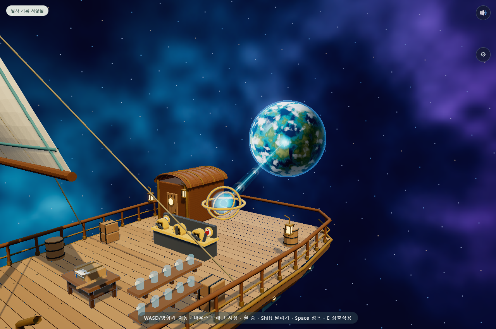

# 행성으로 뻗는 항로의 빛

항해 고리 중심과 먼 행성의 가까운 표면을 푸른 빛으로 연결했다. 항로를 맞추기 전에는 희미한 길이 보이고, 맞추면 1.6초에 걸쳐 밝은 빛이 행성으로 뻗는다. 이후 밝은 마디들이 같은 방향으로 흐른다. 고리 중심과 행성 도착점에는 부드러운 빛 번짐을 넣었다.

기존 항로 열림 상태를 읽으며 별도의 저장 상태는 추가하지 않는다. 수첩·배 관찰 중에는 기존 게임 정지 규칙을 따른다. 운영체제의 동작 줄이기 설정에서는 빛이 즉시 연결되고 흐르는 마디를 숨긴다. 효과는 충돌과 그림자를 만들지 않는다.

검증: 범선 검사 12개와 A~X, 소스 117개 모듈·297개 로컬 import·vendor 해시 19개 통과. `tools/check-star-route.cjs`에서 빛의 전개 순서·행성 표면 도착점·동작 줄이기·셰이더 렌더링을 검사한다. 검사 환경의 외부 네트워크 차단 오류는 그래픽 오류와 구분하여 제외한다.

이번 변경은 로컬 적용이다.
