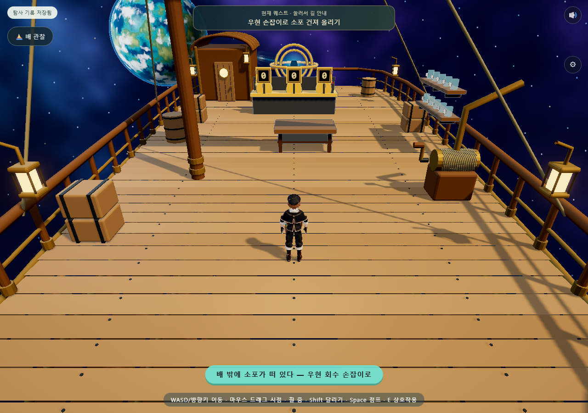
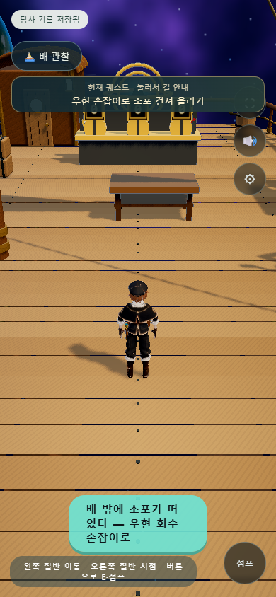

# 하늘의 항해사 — 로컬 게임 연결

## 배포 전 마무리

캐릭터의 원래 텍스처를 약한 자체 발광에도 사용해 어두운 부분의 색이 뭉치는 현상을 줄였다. 공중 상태에서 지면으로 전환될 때 약 0.25초 동안 무릎과 몸의 짧은 착지 반응을 추가했다. 이동·모바일·저장·퀘스트·균형 신전 검사를 다시 실행하고 배포한다. 손가락 개별 리깅이나 모든 물건에 대한 정밀 접촉까지 완료한 것은 아니다.

## 소품 부착·운반 자세 보완

망원경과 수첩의 허리 부착점을 몸 가까이 조정하고 가죽 고리·벨트 연결 끈·버클을 추가했다. 망원경 흔들림을 줄였다. 운반·독서 자세는 두 팔의 실제 길이로 팔꿈치 위치를 계산하고 손목을 목표점으로 맞춘다. 균형 신전 상자는 몸 앞 0.53 위치에서 밑면을 손 높이 가까이 두며, 점프 높이를 따라간다. 내려놓으면 상자 방향을 원래대로 돌린다.

운반 자세 양손의 목표 오차는 정지 상태에서 약 0.03~0.04 게임 단위로 확인했다. 실제 손가락 접촉과 다른 크기의 소품을 모두 자동으로 맞추는 전신 IK는 아니다. 게임 연결·걷기/달리기·균형 신전 8개 흐름 검사를 다시 통과했다.

## 사용자 제보 후 수정: 이동 중 동작이 멈추던 문제

동작 JSON에서 UUID가 빠졌다. Three r160의 `AnimationClip.parse`가 생성된 UUID를 undefined로 덮어쓰므로 믹서는 대기·걷기·달리기를 같은 액션으로 재사용했다. 로더에서 각 클립에 고유 UUID를 부여해 수정했다.

기존 검사는 수동 팔 자세의 변화도 동작으로 인정했기 때문에 실제 다리가 멈춘 문제를 놓쳤다. 아래 초기 검증 기록 중 게임의 걷기·달리기 연결에 대한 판단은 이 수정 전에는 충분하지 않았다.

`tools/check-navigator-locomotion.cjs`는 실제 `game.step` 이동 경로에서 세 액션과 고유 ID를 확인하고, 걷기/달리기 각각 양쪽 허벅지·무릎의 여러 프레임, 해당 동작의 가중치, 정지 후 자세 안정화를 검사한다. 모두 통과했다. [수정 검증 결과](evidence/navigator-game/locomotion.json)

범선·행성·신전의 플레이어 표시를 실제 Meshy 골격 모델로 연결했다. 이동·충돌·상호작용·저장 규칙은 기존 코드를 사용한다. 모델을 불러오지 못한 경우에만 기존 탐험가 모델로 실행한다.

## 적용

- 실제 24본 골격과 스킨, 걷기·달리기 클립. 세 동작 파일에서 중복 메시·텍스처를 제거하고 157KB 정도의 트랙 JSON으로 분리했다. 골격 모델은 약 7MB다.
- Blender로 수첩·망원경을 별도 제작했다. 수첩은 캐릭터 오른쪽, 망원경은 왼쪽 허리의 골격 부착점에 연결한다. 수첩을 얻기 전에는 수첩 소품을 숨긴다.
- 대기 A 포즈의 팔을 자연스럽게 내리고, 점프·활공·운반·수첩 읽기는 실제 뼈 방향을 조정한다. 점프 전용 외부 모션 클립을 새로 생성한 것은 아니다.
- 숫자 0번 상자도 운반 중으로 인식한다. 물건의 위치·정답 판정은 퍼즐이 담당하며 손가락까지 표면에 붙이는 정밀 IK는 아니다.
- 수첩 UI를 열면 읽는 자세와 표지 열림을 적용하고, 닫으면 허리로 돌아간다. 수첩 UI의 기존 기록 기능을 유지한다.
- 기존 활공막을 새 골격 자세와 함께 표시한다. 저장 형식에 모델·뼈 객체를 넣지 않는다.

## 제작 파일

- `art/sky-navigator/navigator-props-v01.blend`: 소품 편집본
- `art/sky-navigator/sky-navigator-rigged-v01.blend`: 몸체·골격 편집본
- `tools/package-navigator.cjs`: 재질 보정과 런타임 모델·동작 분리
- `tools/blender/build_navigator_props.py`: 소품 재생성
- `src/sphere/Navigator.js`: 골격 복제·애니메이션·소품·자세 연결

## 확인 결과

- [PC 검사](evidence/navigator-game/report.json): 범선·신전, 실제 골격 움직임, 0번 상자, 활공, 수첩 부착점 복귀, 유한한 회전값.
- [모바일 검사](evidence/navigator-game/mobile.json): 터치 화면, 캐릭터 로드, 저장·재접속, 브라우저 오류 없음.
- 기존 균형 신전 8개 검사 통과: 난이도·세 퍼즐·저장·마지막 이벤트·자동 퇴장·밀봉.
- 소스 122모듈, 로컬 import 315개, vendor 해시 19개 통과. 기존 상태 8개와 저장·백업·저장 실패 검사 통과.

현재 의상은 선택한 항해사 고정 디자인이다. 기존 색상·머리 선택 데이터는 보존하지만 새 텍스처에 부분별 커스터마이즈를 구현하지는 않았다. 개별 손가락과 망토 보조 뼈가 없는 기본 골격이므로 극단적인 팔 자세의 의상 겹침과 손 접촉은 추가로 다듬을 부분이다. 실제 저사양 휴대폰의 장시간 성능까지 검증한 것은 아니다.

로컬 적용 완료. 이 변경은 아직 GitHub·Vercel에 게시하지 않았다.
