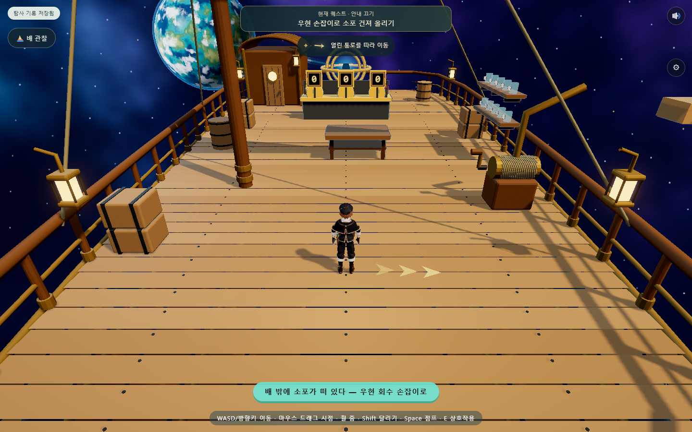
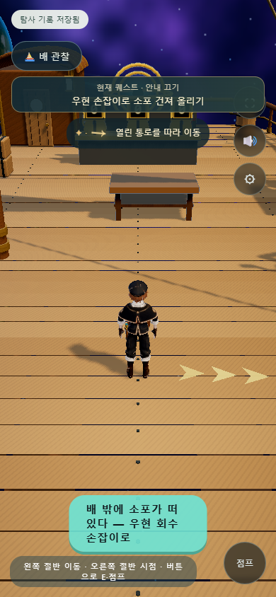

# 상단 퀘스트와 금빛 길 안내

2026-09-10 · 로컬 적용

상단의 현재 퀘스트를 클릭하거나 터치하면 화면의 방향 화살표와 캐릭터 앞 금빛 표식을 켜고 끈다. 수첩의 기록과 기존 저장 형식은 유지한다. 안내를 켠 상태에서는 다음 목표로 자동 전환한다. 재접속하면 저장된 진행도에서 목표를 다시 계산하며 안내 표시는 기본으로 꺼진다.

## 목표 흐름

- 범선: 우현 회수 손잡이 → 소포 도착 → 수첩 찾기 → 수첩 읽기 → 항해 고리 → 출항.
- 행성: 입장 조건을 만족하는 가까운 미완료 사당. 다섯 구슬이 필요한 마지막 사당과 밀봉된 사당은 조건에 맞춰 제외한다.
- 사당: 첫 미완료 방의 목표 → 최종 퍼즐 → 보상 또는 균형의 신 알현 → 귀환.
- 모든 사당 완료: 범선 귀환 → 소포 보내기.

퍼즐 안내는 해당 방의 진입 지점까지이며 상자 무게 순서·배치·지레 정답은 공개하지 않는다. 수첩 읽기와 소포 인양 대기처럼 이동이 필요 없는 단계는 행동 안내만 표시한다.

## 길 안내와 범위

실내는 열린 바닥 영역과 닫힌 문, 원형·선분형 장애물로 작은 격자 경로를 계산한다. 경로가 없으면 화살표를 숨기고 주변 장치와 통로를 살펴보도록 안내한다. 이동과 퍼즐 판정은 기존 게임이 담당한다. 특수 지형의 점프·낙하 해법을 자동으로 찾는 기능은 아니다.

행성에서는 구면의 목적지 방향을 알려준다. 산과 나무를 우회하는 전체 경로 탐색은 포함하지 않는다. 대사·수첩·설정·배 관찰 중에는 안내를 숨긴다. 모션 감소 설정에서는 금빛 깜박임을 멈춘다.

## 확인

`tools/check-quest-guide.cjs`: PC/모바일 클릭·터치, 화면 폭, 목표 전환, 저장 상태 불변, 배 관찰 중 숨김, 닫힌 문 경로 차단, 장애물 우회, 잠긴 마지막 사당 제외, 브라우저 오류 검사.

GitHub와 Vercel에는 이 기능을 아직 게시하지 않았다.
